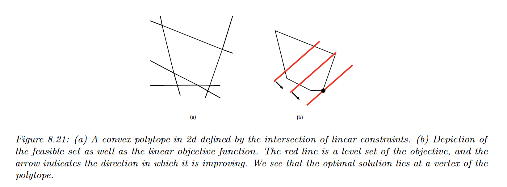
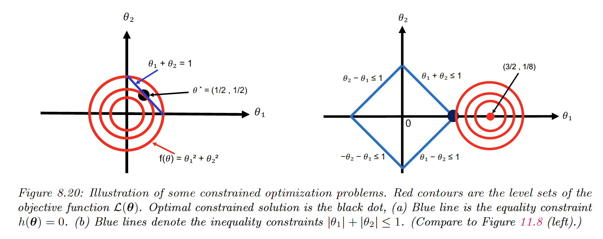

# 8.5 Constrained Optimization

We consider the following problem:

$$
\theta^*=\argmin_{\theta \in \mathcal{C} }\mathcal{L}(\theta)
$$

where the feasible set is:

$$
\mathcal{C}= \{\theta \in \mathbb{R}^D:h_i(\theta)=0, i \in \mathcal{E},\space g_j(\theta)\leq 0,j\in \mathcal{I}\}
$$

with $\mathcal{E}$ is the set of equality constraints and $\mathcal{I}$ the set of inequality constraints.

### 8.5.1 Lagrange Multipliers

Let’s have a single constrained $h(\theta)=0$.

We know that the gradient of the loss and the gradient of the constraint are (anti-?)parallel at some point $\theta^*$ minimizing $\mathcal{L}(\theta)$.

- proof
    
    If we move by $\epsilon$ on the constraint surface we have:
    
    $$
    h(\theta+\epsilon) \approx h(\theta)+\epsilon^\top \nabla h(\theta)
    $$
    
    As we have $h(\theta+\epsilon)=h(\theta)=0$, we must have $\epsilon \perp \nabla h(\theta)$.
    
    We seek a point $\theta^*$  on the constrained surface minimizing $\mathcal{L}(\theta)$. $\nabla \mathcal{L}(\theta)$ must also be orthogonal to the constraint surface, otherwise we could decrease the objective by just moving on the surface.
    
    ---
    

$$
h(\theta^*)=\lambda \mathcal{L}(\theta^*)
$$

for some $\lambda\in \mathbb{R}$.

This leads to the objective:

$$
L(\theta,\lambda) \triangleq \mathcal{L}(\theta)+\lambda h(\theta)
$$

At a stationary point, we have:

$$
\nabla_{\theta,\lambda}L(\theta,\lambda)=0 \iff \lambda\nabla_\theta h(\theta)=\nabla \mathcal{L(\theta)},h(\theta)=0
$$

This is called a critical point.

If we have $m>1$ constraints, we can add them:

$$
L(\theta,\lambda)=\mathcal{L}(\theta)+\sum_{i=1}^m \lambda_i h_i(\theta)
$$

We end up with $D+m$ equations for $D+m$ variables and can use unconstrained optimization methods to solve this system.

**Exemple**

We minimize $\mathcal{L}(\theta_1,\theta_2)=\theta_1^2+\theta_2^2$, subject to the constraint $\theta_1+\theta_2=1$.

The Lagrangian is:

$$
L(\theta_1,\theta_2,\lambda)= \theta_1^2+\theta_2^2+\lambda(\theta_1+\theta_2-1)
$$

Therefore we need to solve:

$$
\begin{align}
\frac{\partial L(\theta_1,\theta_2,\lambda)}{\partial \theta_1} &=2\theta_1+  \lambda =0 \\
\frac{\partial L(\theta_1,\theta_2,\lambda)}{\partial \theta_2} &=2\theta_2+ \lambda =0 \\
\frac{\partial L(\theta_1,\theta_2,\lambda)}{\partial \lambda} &= \theta_1+\theta_2-1=0
\end{align}
$$

### 8.5.2 The KKT conditions

We introduce inequality constraints $g(\theta)\leq0$:

$$
L(\theta)=\mathcal{L}(\theta)+\infin I(g(\theta)>0)
$$

However, this is a discontinuous function that is hard to optimize.

Instead, we can consider $\mu\geq0:$

$$
L(\theta)=\mathcal{L}(\theta)+\mu g(\theta)
$$

and our optimization problem becomes:

$$
\min_\theta \max_{\mu \geq 0} L(\theta,\mu)
$$

The general Lagrangian becomes:

$$
L(\theta,\lambda,\mu)=\mathcal{L}(\theta)+\sum_{i=1}^m \lambda_i h_i(\theta) + \sum_{j=1}^n \mu_j g_j(\theta)
$$

When $\mathcal{L}$ and $g$ are convex, then all critical points must satisfy the Karush-Kuhn-Tucker (KKT) conditions:

- All constraints are satisfied (feasibility)
    
    $$
    g(\theta)\leq 0,h(\theta)=0
    $$
    
- The solution is a stationary point:
    
    $$
    \nabla \mathcal{L}(\theta^*)+\sum_{i=1}^m \lambda_i \nabla h_i(\theta) + \sum_{j=1}^n \mu_j \nabla g_j(\theta)=0
    $$
    
- The penalty for the inequality constraints points in the right direction (dual feasibility):
    
    $$
    \mu \geq 0
    $$
    
- The Lagrange multiplies pick up any slack in the inequality constraints:

$$
\mu \odot g=0
$$

If the $\mathcal{L}$ is convex and the constraints define a convex set, then the KKT conditions are sufficient to ensure global optimality.

### 8.5.3 Linear Programming

We optimize a linear function subject to linear constraints, represented as:

$$
\min_\theta c^\top \theta \quad s.t. \quad A\theta \leq b,\space\theta \geq 0
$$

The feasible set defines a convex polytope: a convex space defined as an intersection of half-spaces.

**8.5.3.1 The simplex algorithm**

It can be shown that the optima of an LP occur at the vertex of the polytope defining the feasible set.

The simplex algorithm solves LPs by moving from vertex to vertex, seeking the edge that most improve the objective.

**8.5.3.2 Applications**

Applications range from business to machine learning, in robust linear regression settings. It is also useful for state estimation in graphical models.

### 8.5.4 Quadratic programming

We optimize a quadratic function:

$$
\min_\theta \frac{1}{2}\theta^\top  H\theta +c^\top \theta +cte \quad s.t. \quad A\theta\leq b, A_{eq}\theta=b_{eq}
$$

If $H$ is semi-positive, then this is a convex problem.

**Example**

Let’s consider:

$$
\mathcal{L}(\theta)=(\theta_1-\frac{3}{2})^2+(\theta_2-\frac{1}{8})^2=\frac{1}{2}\theta^\top H \theta + \theta^\top c +cte
$$

with $H=2I$ and $c=-(3,1/4)$

Subject to $|\theta_1|+|\theta_2|\leq 1$

We can decompose the above constraint into:

$$
\begin{align}
\theta_1+\theta_2 &\leq 1 \\
\theta_1-\theta_2 &\leq 1 \\
-\theta_1+\theta_2 &\leq 1 \\
-\theta_1-\theta_2 &\leq 1 \\
\end{align}
$$

We can write as $A\theta -b \leq 0$, with

$$
A=\begin{bmatrix}
1 & 1 \\
1 & -1 \\
-1 & 1 \\
-1 & -1
\end{bmatrix}
$$

This is now in the standard QP form.

We see that the 2 edges of the diamond to the left are inactive because the objective is in the opposite directions.

This means $g_3>0$ and $g_4>0$ and by complementarity  $\mu_3^*=\mu_4^*=0$

From the KKT conditions, we know that:

$$
H\theta +c+A^\top\mu=0
$$

This gives us:

$$
\begin{bmatrix}
2 & 0 & 1 & 1\\
0 & 2 & 1 & -1 \\
1 & 1 & 0 & 0 \\
1 & -1 & 0 & 0 \\
\end{bmatrix}

\begin{bmatrix}
\theta_1 \\
\theta_2 \\
\mu_1 \\
\mu_2 \\
\end{bmatrix}=
\begin{bmatrix}
3 \\
1/4 \\
1 \\
1 \\
\end{bmatrix}
$$

The solution is $\theta=(1, 0)^\top, \mu=(0.625, 0.375,0,0)^\top$

**8.5.4.1 Applications**

QP programming is used in the lasso method for sparse linear regression, which optimizes:

$$
\mathcal{L}(\beta)=||X\beta - Y ||^2_2+\lambda ||\beta||_1
$$

It can also be used for SVM.