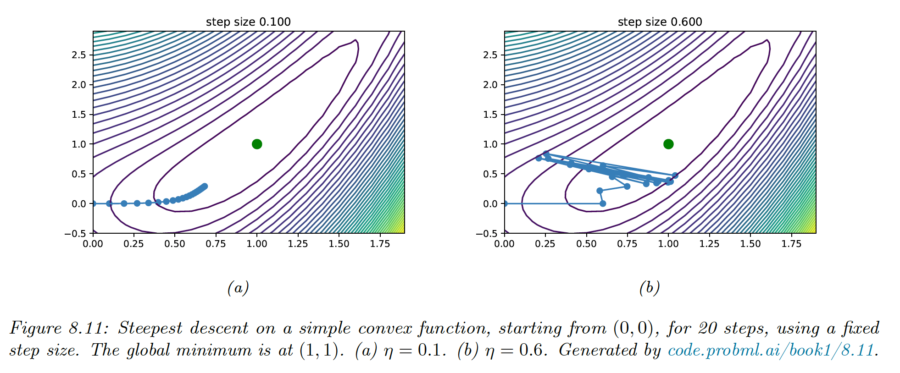
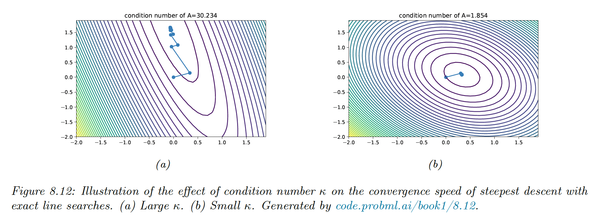
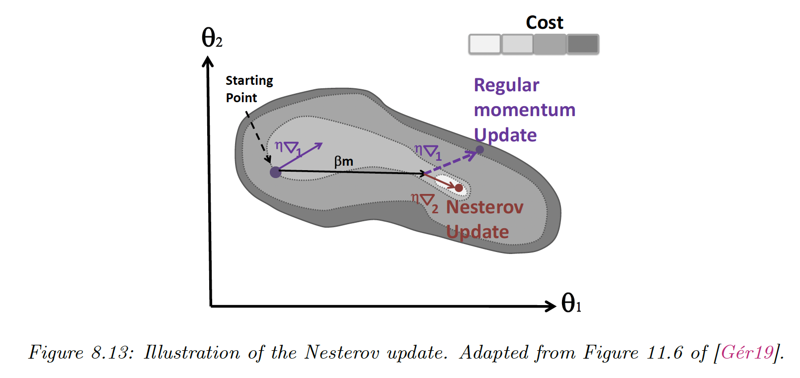

# 8.2 First-Order Methods

First-order methods compute first-order derivatives of the objective function but they ignore the curvature information.

All these algorithms required the user to choose a starting point $\theta_0$ before iterating:

$$
\theta_{t+1}=\theta_t +\eta_t \bold{d}_t
$$

where $\eta_t$ is the learning rate and $\bold{d_t}$ is the descent direction, such as the negative of the gradient $\bold{g}_t=\nabla_\theta \mathcal{L}(\theta)|_{\theta_t}$.

These update steps are performed until reaching a stationary point.

### 8.2.2 Step size

The sequence of steps $\{\eta_t\}$ is the learning rate schedule. We describe some methods to pick this.

#### 8.2.2.1 Constant step size

The simplest method is to consider $\eta_t=\eta$. However, if set too large the method will fail to converge, and if set too small, the method will converge very slowly.

We can derive a theoretical upper bound for the step size. For a quadratic objective function:

$$
\mathcal{L}(\theta)=\frac{1}{2}\theta^\top A \theta+\bold{b}^\top\theta+c
$$

with $A$  positive semi-definite, the steepest descent will converge iff the step size satisfies:

$$
\eta <\frac{2}{\lambda_{max}(A)}
$$

This ensures that the step is lower than the slope of the steepest direction, which the eigenvalue measures.

More generally:

$$
\eta <\frac{2}{L}
$$

where $L$ is the Lipschitz constant of the gradient —but this constant is usually unknown.

#### 8.2.2.2 Line search

The optimal step size can be found by solving the optimization:

$$
\eta_t=\argmin_{\eta >0}\mathcal{L}(\theta_t+\eta \bold{d}_t)
$$

If the loss is convex, this subproblem is also convex because the update term is affine.

If we take the quadratic loss as an example, we solve:

$$
\frac{d}{d \eta}\Big[\frac{1}{2}(\theta+\eta \bold{d})^\top A(\theta+\eta \bold{d}) +\bold{b}^\top(\theta+\eta \bold{d})+c\Big]
$$

and find:

$$
\eta=\frac{\bold{d}^\top(A \theta +b)}{\bold{d}^\top A\bold{d}}
$$

However, it is often not necessary to be so precise; instead, we can start with the current step size and reduce it by a factor $0<\beta<1$ at each step until it satisfies the **Armijo-Goldstein** test:

$$
\mathcal{L}(\theta_t+\eta\bold{d}_t)\leq \mathcal{L}(\theta_t)+c\eta \bold{d}_t^\top \nabla \mathcal{L}(\theta_t)
$$

where $c\in[0,1]$, typically $c=10^{-4}$.

### 8.2.3 Convergence rates

In some convex problems where the gradient is bounded by the Lipschitz constant, gradient descent converges at a linear rate:

$$
||\mathcal{L}(\theta_{t+1})-\mathcal{L}(\theta_*)||\le \mu ||\mathcal{L}(\theta_t) - \mathcal{L}(\theta_*)||
$$

where $\mu\in[0,1]$ is the convergence rate.

For simple problems like the quadratic objective function, we can derive $\mu$ explicitly. If we use the steepest gradient descent with line search, the convergence rate is given by:

$$
\mu=\Big(\frac{\lambda_{\max}-\lambda_{\min}}{\lambda_{\max}+\lambda_{\min}}\Big)^2
$$

Intuitively, the condition problem $\kappa=\frac{\lambda_{\max}}{\lambda_{\min}}$ represents the skewness of the space —i.e. being far from a symmetrical bowl.

More generally, the objective around the optimum is locally quadratic, hence the convergence rate depends on the condition number of the Hessian at that point: $\kappa(H)$. We can improve the speed of convergence by using a surrogate model that has a Hessian close to the Hessian of the objective.

Line search often exhibits zig-zag paths that are inefficient, instead, we can use conjugate gradient descent.

#### 8.2.3.1 Conjugate gradient descent

$\bold{u,v}$ are conjugate vectors w.r.t $A$ iff:

$$
\bold{u}^\top A\bold{v}=0
$$

Let $P=\{\bold{p}_1,\dots,\bold{p}_n\}$ is a set of mutually conjugate vectors, i.e. $\bold{p}_i^\top A \bold{p}_j=0$ for $i \neq j$.

$P$ forms a basis for $\mathbb{R}^n$, and we can write:

$$
\theta_*=\sum_{i=1}^n \eta_i \bold{p}_i
$$

The gradient of the quadratic objective function is:

$$
\nabla \mathcal{L}(\theta)=A\theta+\bold{b}
$$

thus we choose our first vector as:

$$
\bold{p}_0=\bold{r}_0=-(A\theta_0+\bold{b})
$$

and we will find other vectors as conjugates with the following update:

$$
\begin{align}
\eta_t &=\frac{\bold{r}_t^\top \bold{r}_t}{\bold{p}_t^\top A \bold{p}_t} \\
\theta_{t+1} &= \theta_t + \eta_t \bold{p}_t \\
\bold{r}_{t+1} &= \bold{r}_t -\eta_t A \bold{p}_t \\
&\mathrm{exit \space if \space \bold{r}_{t+1} \space small \space enough } \\
\beta_t &= \frac{\bold{r}_{t+1}^\top \bold{r}_{t+1}}{\bold{r}_t^\top \bold{r}_t} \\
\bold{p}_{t+1} &= \bold{r}_{t+1}+\beta_t \bold{p}_t \\
t &= t+1
\end{align}
$$

### 8.2.4 Momentum methods

#### 8.2.4.1 Momentum

This can be implemented as follow:

$$
\begin{align}
\bold{m}_t &=\beta \bold{m}_{t-1} + \bold{g}_{t-1} \\
\theta_t &= \theta_{t-1}-\mu_t \bold{m}_t
\end{align}
$$

with $\beta \in[0,1]$, usually $\beta=0.9$.

Where the momentum $\bold{m}_t$ plays the role of an exponentially weighted moving average of the gradient:

$$
\bold{m}_t=\sum_{k=0}^{t-1} \beta^k\bold{g}_{t-k -1}
$$

#### 8.2.4.2 Nesterov momentum

The standard momentum issue is that it may not slow down enough at the bottom of the valley and causes oscillations.

To mitigate this, Nesterov accelerated gradient adds extrapolation steps to the gradient descent:

$$
\begin{align}
\tilde{\theta}_{t+1} &=\theta_t+\beta_t(\theta_t-\theta_{t-1}) \\
\theta_{t+1} &= \tilde{\theta}_{t+1} - \mu_t \nabla \mathcal{L(}\tilde{\theta}_{t+1})
\end{align}
$$

This can be rewritten in the same format as the momentum:

$$
\begin{align}
\bold{m}_t &=\beta\bold{m}_{t-1}-\mu_{t-1} \nabla \mathcal{L}(\theta_{t-1}+\beta \bold{m}_{t-1}) \\
\theta_t &= \theta_{t-1}+\bold{m}_t
\end{align}
$$

This method can be faster than standard momentum because it measures the gradient at the next location.

In practice, using the Nesterov momentum can be unstable if $\beta$ or $\mu_t$ are misspecified.