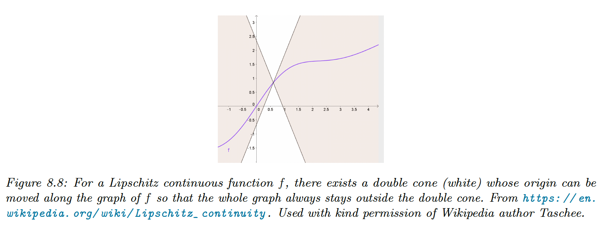

# 8.1 Intro

Optimization is at the core of machine learning: we try to find the values of a set of variable $\theta \in \Theta$ that minimizes a scalar-valued loss function $\mathcal{L}:\Theta\rightarrow \mathbb{R}$:

$$
\theta^*=\argmin_{\theta\in\Theta}\mathcal{L}(\theta)
$$

with the parameter space $\Theta\subset\mathbb{R}^D$.

An algorithm minimizing this loss function is called a solver.

### 8.1.1 Local vs Global Optimization

The global optimum is the point that satisfies the general equation, but finding it is computationally intractable.

Instead, we will try to find a local minimum. We say that $\theta^*$ is a local minimum if:

$$
\exist \,\epsilon>0\,,\space\forall \,\theta\in\Theta\;s.t.\;||\theta-\theta^*||<\epsilon,\space\mathcal{L(\theta^*)}\leq\mathcal{L}(\theta)
$$

A local minimum can be flat (multiple points of equal objective value) or strict.

A globally convergent algorithm will converge to a stationary point, although that point doesn’t have to be the global optimum.

Let $g(\theta)=\nabla \mathcal{L}(\theta)$  and $H(\theta)=\nabla^2\mathcal{L(\theta)}$ hessian matrix. 

- Necessary condition:  $\theta^*$ is a local minimum $\implies$ $\bold{g}^*=\bold{0}$ and $H^*$ is positive semi-definite
- Sufficient condition: $\bold{g}^*=\bold{0}$ and $H^*$ positive definite $\implies$ $\theta^*$ is a local minimum

The condition on $H^*$ is necessary to avoid saddle points —in this case, the eigenvalues of the Hessian will be both positive and negative, hence non-positive definite. 

### 8.1.2 Constrained vs Unconstrained Optimization

In unconstrained optimization, we minimize the loss with any value in the parameter space $\Theta$.

We can represent inequality constraints as $g_j(\theta)\leq 0$ for $j\in \mathcal{I}$ and equality constraints as $h_k(\theta)=0$ for $k\in \mathcal{E}$

The feasible set is then:

$$
\mathcal{C}=\{\theta:g_j(\theta)\leq 0:j\in\mathcal{I},h_k(\theta)=0:k\in\mathcal{E}\}\subseteq \mathbb{R}^D
$$

And the constraint optimization problem becomes:

$$
\theta^*=\argmin_{\theta\in \mathcal{C}}\mathcal{L}(\theta)
$$

Adding constraints can create new minima or maxima until the feasible set becomes empty.

A common strategy for solving constrained optimization is to combine penalty terms, measuring how much we violated the constraints, with the unconstrained objective. The Lagrangian is a special case of this combined objective.

### 8.1.3 Convex vs Nonconvex Optimization

In convex optimization, every local minimum is a global minimum, therefore many machine learning models are designed so that their training objective is convex.

$\mathcal{S}$ is a convex set if for any $x, x' \in \mathcal{S}$ and $\lambda\in[0, 1]$ we have:

$$
\lambda x+(1-\lambda)x' \in \mathcal{S}
$$

We say $f$ is a convex function if its **epigraph** (the set of points above the function) defines a convex set.

Equivalently, $f(\bold{x})$ is convex if it is defined on a convex set, and for any $\bold{x, y} \in \mathcal{S}$ and $\lambda\in[0,1]$:

$$
f(\lambda \bold{x}+(1-\lambda)\bold{y})\leq \lambda f(\bold{x})+(1-\lambda)f(\bold{y})
$$

$f(\bold{x})$ is concave if $-f(\bold{x})$  is convex.

Suppose $f:\mathbb{R}^n \rightarrow \mathbb{R}$ is twice differentiable, then:

- $f$ is convex iff $H=\nabla^2f(\bold{x})$ is positive **semi** definite.
- $f$ is **strictly** convex iff $H=\nabla^2f(\bold{x})$ is positive definite

  

For example, let’s consider the quadratic form $f(\bold{x})=\bold{x}^\top A\bold{x}$. It is convex if $A$ is positive definite.

Furthermore, $f$ is **strongly** convex with parameter $m>0$ if for any $\bold{x, y}$ in its subspace:

$$
(\nabla f(\bold{x})-\nabla f(\bold{y}))^\top(\bold{x}-\bold{y})\geq m ||\bold{x}-\bold{y}||^2
$$

If $f$ is twice differentiable, then it is strongly convex with parameter $m$ iff $\nabla^2f(\bold{x}) \succeq mI$ —meaning $\nabla^2f(\bold{x}) -mI$  is positive definite.

In the real line domain, this condition becomes $f''(x)\geq m$.

In conclusion:

- $f$ is convex iff $f''(x)\geq0$
- $f$ is strictly convex if $f''(x)>0$
- $f$ is strongly convex with parameter $m$ iff $f''(x)\geq m>0$

### 8.1.4 Smooth vs Non-smooth Optimization

In smooth optimization, the objective function is continuously differentiable, and we quantify the smoothness using the **Lipschitz constant**. In the 1d case:

$$
|f(x_2)-f(x_1)|\leq L |x_1-x_2|
$$

The function output can’t change by more than $L$ if we change the input by $1$ unit.

Non-smooth functions have at least some functions in the gradient that are not defined:

In some problems we can partition the objective into a part containing only smooth terms and a part with nonsmooth (rough) terms:

$$
\mathcal{L}(\theta)=\mathcal{L}_s(\theta)+\mathcal{L}_r(\theta)
$$

In machine learning, these **composite objectives** are often formed with $\mathcal{L}_s(\theta)$ the training loss and $\mathcal{L}_r(\theta)$ a regularizer such as the $\ell_1$ norm of $\theta$.

**8.1.4.1 Subgradients**

We generalize the notion of derivative to function with local discontinuities.

For $f:\mathbb{R}^n\rightarrow \mathbb{R}$, $\bold{g}\in\mathbb{R}^n$ is the subgradient of at $\bold{x} \in \mathrm{dom}({f})$:

$$
f(\bold{z})\geq f(\bold{x})+\bold{g}^\top (\bold{z}-\bold{x})
$$

For example, the subdifferential  of $f(x)=|x|$ is:

$$
\partial f (x) =
\begin{cases}
\{-1\} & \mathrm{if}\space x<0 \\
[-1, 1] & \mathrm{if}\space x=0 \\ 
\{1\} & \mathrm{if}\space x>0
\end{cases}
$$

