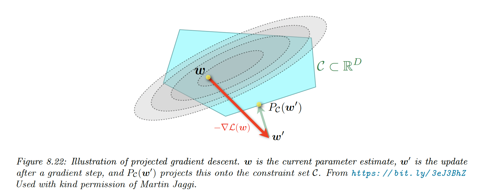

# 8.6 Proximal gradient method

We are often interested in optimizing an objective of the form:

$$
\mathcal{L}(\theta)=\mathcal{L}_s(\theta)+\mathcal{L}_r(\theta)
$$

where:

- $\mathcal{L}_s$ is a differentiable (smooth) loss, like the NLL
- $\mathcal{L}_r$ is a convex loss but may not be differentiable, like the $\ell_1$ norm or an indicator function that is infinite when constraints are violated.

One way to solve this is to use a Proximal gradient method: take a step size $\mu$  in the gradient direction and then project the result in the constraints space respecting $\mathcal{L}_r$:

$$
\theta_{t+1}=\mathrm{prox}_{\mathcal{L_r}, \mu}(\theta_t-\mu_t \nabla \mathcal{L}_s(\theta_t))
$$

where:

$$
\mathrm{prox}_{\mathcal{L}_r, \mu} = \argmin_z \Big(\mathcal{L}_r(z) + \frac{1}{2\mu}||z-\theta||^2_2 \Big)
$$

We can rewrite the proximal operator as a constraint optimization problem:

$$
\argmin_z \mathcal{L}_r(z)\quad s.t \quad ||z-\theta||_2\leq \rho
$$

Thus the proximal function minimizes the rough loss while staying close to the current iterate $\theta_t$.

### 8.6.1 Projected gradient descent

We want to optimize:

$$
\argmin_{\theta}\mathcal{L}_s(\theta) \quad s.t. \quad \theta \in \mathcal{C}
$$

where $\mathcal{C}$ is a convex set.

We can have box constraints, with $\mathcal{C}=\{\theta :l \leq \theta \leq u \}$

In unconstrained settings, this becomes:

$$
\mathcal{L}(\theta)=\mathcal{L}_s(\theta)+\mathcal{L}_r(\theta)
$$

with:

$$
\mathcal{L}_r(\theta)=I_\mathcal{C}(\theta)=
\begin{cases} 0 \quad \mathrm{if} \;\theta \in \mathcal{C} \\
\infin \quad o.w
\end{cases}
$$

We can solve that with the proximal gradient operator:

$$
\mathrm{proj}_\mathcal{C}(\theta)=\argmin_{\theta' \in \mathcal{C}} ||\theta'-\theta||_2
$$

In the box constraints example, the projection operator can be computed element-wise:

$$
\mathrm{proj}_{\mathcal{C}}(\theta)_d=
\begin{cases}
l_d \quad \mathrm{if}\; \theta_d\leq l_d \\
\theta_d \quad \mathrm{if}\; l_d \leq \theta_d \leq u_d \\
u_d \quad \mathrm{if}\;  u_d \leq \theta_d
\end{cases}
$$

### 8.6.2 Proximal operator for the L1-norm regularizer

A linear predictor has the form $f(x,\theta)=\sum_d \theta_d x_d$.

We can foster model interpretability and limit overfitting by using feature selection, by encouraging weight to be zero by penalizing the $\ell_1$ norm:

$$
||\theta||_1=\sum_d |\theta_d|
$$

This induces sparsity because if we consider 2 points: $\theta=(1,0)$ and $\theta'=(1/\sqrt{2},1/\sqrt{2})$, we have $||\theta||_2=||\theta'||_2$ but $||\theta||_1 < ||\theta'||_1$.

Therefore the sparse solution $\theta$ is cheaper when using the $\ell_1$ norm.

If we combine our smooth loss with the regularizer we get:

$$
\mathcal{L}(\theta)=NLL(\theta)+\lambda||\theta||_1
$$

We can optimize this with the proximal operator, in a element-wise fashion:

$$
\mathrm{prox}_\lambda(\theta)=\argmin_{z} |z| + \frac{1}{2\lambda} (z-\theta)^2
$$

In section 11.4.3, we show that the solution is given by the soft threshold operator:

$$
\mathrm{prox}_\lambda(\theta)=
\begin{cases}
\begin{align}
\theta + \lambda \quad &\mathrm{if}\; \theta \leq -\lambda \\
0 \quad &\mathrm{if}\; |\theta|\leq \lambda \\
\theta -\lambda \quad &\mathrm{if} \;\theta\geq \lambda 
\end{align}
\end{cases}
$$

### 8.6.3 Proximal operator for quantization

In some applications like edge computing, we might want to ensure the parameters are quantized.

We define a regularizer measuring the distance between the parameter and its nearest quantized version:

$$
\mathcal{L}_r(\theta)=\argmin_{\theta_0\in\mathcal{C=\{-1,+1\}}}||\theta-\theta_0||_1
$$

In the case $\mathcal{C}=\{-1,+1\}^D$, this becomes:

$$
\mathcal{L_r}(\theta)=\sum_{d=1}^D \argmin_{\theta_{0,d}\in \{-1,+1\}}|\theta_d-\theta_{0,d}|
$$

We solve this with proximal gradient descent, in which we treat quantization as a regularizer: this is called ProxQuant.

The update becomes:

$$
\tilde{\theta}_t=\mathrm{prox}_{\lambda, {\mathcal{L}_r}}(\theta_t-\mu_t \nabla \mathcal{L}_s(\theta_t))
$$

### 8.6.4 Incremental (online) proximal methods

Many ML problems have an objective function that is the sum of losses, one per example: these problems can be solved incrementally, with online learning.

It is possible to extend proximal methods to these settings, the Kalman Filter is one example.