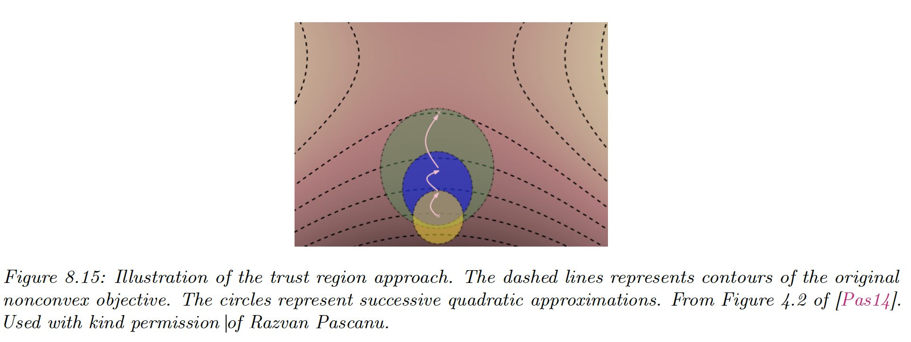

# 8.3 Second-order methods

First-order methods only exploit the gradient of the loss function, which is cheap to compute but can be imprecise. Second-order methods leverage the curvature of the loss using the Hessian.

### 8.3.1 Newton’s method

The classic second-order method is Newton’s method, whose update is:

$$
\theta_{t+1}=\theta_t-\mu_t H^{-1}_t \bold{g}_t
$$

where $H_t$ is assumed positive-definite. The intuition is that $H^{-1}$ “undoes” the skewness in the local curvature.

To see why, consider the Taylor series approximation of $\mathcal{L(\theta)}$ around $\theta_t$:

$$
\mathcal{L}(\theta)=\mathcal{L}(\theta_t)+\bold{g}^\top_t(\theta-\theta_t)+\frac{1}{2} (\theta-\theta_t)^\top H_t (\theta-\theta_t)
$$

The differential w.r.t $\theta$ gives:

$$
\theta=\theta_t-H_t^{-1}\bold{g}_t
$$

### 8.3.2 BFGS

Quasi-Newton methods iteratively build up an approximation to the Hessian, using information about the gradient at each step:

$$
H_{t+1}\approx B_{t+1}=B_t+\frac{\bold{y}_t\bold{y}_t^\top}{\bold{y}_t^\top \bold{s}_t}-\frac{(B_t\bold{s}_t)(B_t\bold{s}_t)^\top}{\bold{s}_t^\top B_t \bold{s}_t}
$$

with $\bold{s}_t=\theta_t-\theta_{t-1}$ and $\bold{y}_t=\bold{g}_t-\bold{g}_{t-1}$

If $B_0$ is positive definite and the step size $\mu$ is chosen via line search satisfying the Armiko condition and the curvature condition:

$$
\bold{d}_t^\top\nabla \mathcal{L}(\theta_t+\mu \bold{d}_t)\geq c_2 \bold{d}_t^\top \nabla \mathcal{L}(\theta_t)
$$

with $c_2\in[c,1]$, then $B_{t+1}$ remains positive definite.

Typically, $B_0=I$.

Alternatively, BFGS can iteratively update an approximate the inverse of the Hessian:

$$
H_{t+1}^{-1}\approx C_{t+1}=\Big(I-\frac{\bold{s}_t \bold{y}_t^\top}{\bold{y}_t^\top \bold{s}_t}\Big) C_t\Big(I-\frac{\bold{y}_t\bold{s}_t ^\top}{\bold{y}_t^\top \bold{s}_t}\Big)+\frac{\bold{s_t}\bold{s_t}^\top}{\bold{y}^\top_t\bold{s}_t}
$$

Since storing the Hessian approximation still takes $O(D^2)$ space, for very large problems the limited memory (L-BFGS) is preferred.

Rather than storing  $B_t$, we store the $M$ most recent $(s_t,y_t)$ and then approximate $H_t^{-1} \bold{g}_t$ by performing a sequence of inner products with the stored $\bold{s}_t$ and $\bold{y}_t$ vectors.

$M$ between 5-20 is often sufficient.

### 8.3.3 Trust region methods

If the objective function is non-convex, then the Hessian may not be positive definite, so $\bold{d}_t=-H_t\bold{g}_t$ may not be the descent direction. In general, any time the quadratic approximation made by Newton’s method is invalid, we are in trouble.

However, there is usually a local region $\mathcal{R}_t$ around the current iterate where we can safely approximate the objective by a quadratic.

Let $M(\delta)$ the approximation to the objective, where $\delta=\theta-\theta_t$. At each step, we solve:

$$
\delta^*=\argmin_{\delta \in \mathcal{R}_t}M_t(\delta)
$$

this is called **trust-region optimization.**

We usually assume $M_t$ is a quadratic approximation:

$$
M_t(\delta)=\mathcal{L}(\theta_t)+\bold{g}_t^\top\delta +\frac{1}{2}\delta^\top H_t \delta
$$

We assume that the region is a ball:

$$
\mathcal{R}_t=\{\delta:||\delta||_2<r\}
$$

The constraint problem becomes an unconstrained one:

$$
\begin{align}
\delta^*  =\argmin_{\delta}M(\delta)&=\bold{g}^\top \delta +\frac{1}{2}\delta^\top H \delta +\lambda ||\delta||_2 \\
&=\bold{g}^\top \delta +\frac{1}{2}\delta^\top (H+\lambda I)\delta
\end{align}
$$

for some Lagrange multiplier $\lambda >0$.

We can solve this using:

$$
\delta=-(H+\lambda I)^{-1}\bold{g}
$$

This is called Tikhonov regularization, adding a sufficiently large $\lambda I$ ensure that the resulting matrix is always positive definite.

See [Beyond auto-differentiation](https://ai.googleblog.com/2023/04/beyond-automatic-differentiation.html) from Google AI using trust region and quadratic approximations.