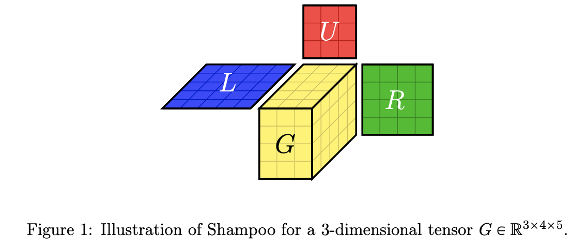

# 8.4 Stochastic gradient descent

The goal is to minimize the average of the loss function:

$$
\mathcal{L}(\theta)=\mathbb{E}_{q(\bold{z})}[\mathcal{L}(\theta,\bold{z})]
$$

where $\bold{z}$ is a training sample. In other words, at each iteration:

$$
\mathcal{L}_t(\theta)=\mathcal{L(\theta,\bold{z}_t)}
$$

where $\bold{z}_t\sim q$.

The resulting algorithm is the SGD:

$$
\theta_{t+1}=\theta_t-\mu_t \nabla \mathcal{L}(\theta_t, \bold{z}_t)=\theta_t-\mu_t \bold{g}_t
$$

As long as the gradient estimate is unbiased, this will converge to a stationary point, providing a decay on $\mu_t$.

### 8.4.1 Finite sum problem

SGD is widely used in ML, because many models are based on empirical risk minimization, which minimizes the following loss:

$$
\mathcal{L}(\theta_t)=\frac{1}{N}\sum_{n=1}^N \mathcal{L}_n(\theta_t)=\frac{1}{N}\sum_{n=1}^N \ell (y_n, f(x_n,\theta_t))
$$

This is called a finite-sum problem. Computing the gradient requires summing over all $N$ examples and can be slow. Fortunately, we can approximate it by sampling a minibatch $B \ll N$:

$$
\bold{g}_t \approx \frac{1}{|B_t|}\sum_{n\in B_t}\nabla_\theta \mathcal{L}_n(\theta_t)
$$

where $B_t$ is a random set of examples. Therefore, SGD is an unbiased estimate of the empirical average of the gradient.

Although the rate of convergence of SGD is slower than in batch GD, the per-step time is lower for SGD. Besides, it is most of the time wasteful to compute the complete gradient, above all at the beginning when the parameters are not well estimated.

### 8.4.2 Example using the LMS

The objective of the linear regression is:

$$
\mathcal{L}(\theta)=\frac{1}{2N}\sum_{n=1}^N (\bold{x}_n^\top \theta-y_n)^2
$$

And its gradient:

$$
\bold{g}_t=\frac{1}{N}\sum_{n=1}^N (\theta_t^\top \bold{x}_n - y_n)\bold{x}_n
$$

And with SGD of batch size $1$ the update is:

$$
\theta_{t+1} = \theta_t -\mu_t (\theta^\top_t \bold{x}_n-y_n)\bold{x}_n
$$

with the index at each iteration $n=n(t)$.

LMS and LGD might need multiple passes to the data to find the optimum.


### 8.4.3 Choosing the step size (learning rate)

An overall small learning rate leads to underfitting, and a large one leads to instability of the model: both fail to converge to the optimum.


Rather than using a single constant, we can use a learning rate schedule. A sufficient condition for SGD to converge is the schedule satisfying the Robbins-Monro condition:

$$
\mu_t\rightarrow 0 ,\frac{\sum_{t=1}^\infin \mu_t^2}{\sum^\infin_{t=1} \mu_t}\rightarrow 0
$$

Some common examples of learning rate schedules:

$$
\begin{align}
\mu_t &=\mu_i \space\space \mathrm{if\space t_i \leq t\leq t_{i+1}} \space \mathrm{piecewise \space constant}\\
\mu_t&=\mu_0 e^{-\lambda t} \mathrm{\space exponential\space decay} \\
\mu_t &= \mu_0 (\beta t+1)^{-\alpha} \space \mathrm{polynomial \space decay}
\end{align}
$$


Piecewise constant schedule reduces the learning rate when a threshold is reached, or when the loss has plateaued, this is called **reduce-on-plateau**.

Exponential decay is typically too fast, and polynomial decay is preferred, here with $\beta=1$ and $\alpha=0.5$.

Another scheduling strategy is to quickly increase the learning rate before reducing it again: we hope to escape a poorly-conditioned loss landscape with small steps, before making progress with larger steps: this is the **one-cycle learning rate schedule**.

We can also repeat this pattern in a **cyclical learning rate schedule** to escape local minima.


### 8.4.4 Iterate averaging

The estimate of the parameter can be unstable with SGD. To reduce the variance, we can compute the average with:

$$
\bar{\theta}_t=\frac{1}{t}\sum^t_{i=1} \theta_i=\frac{1}{t}\theta_t+\frac{t}{t-1}\bar{\theta}_{t-1}
$$

This is called **iterate averaging** or **Polyak-Ruppert averaging.** It has been proven that this method yields the best asymptotic convergence for SGD, matching second-order methods.

[**Stochastic Weight Averaging (SWA)](https://pytorch.org/blog/pytorch-1.6-now-includes-stochastic-weight-averaging/)** exploits the flatness in objective to find solutions that provide better generalization rather than quick convergence. It does so using an equal average with a modified learning rate schedule.

### 8.4.5 Variance reduction

These methods reduce the variance of the gradients in SGD, rather than the parameters themselves, and can improve the convergence rate from sublinear to linear. 

**8.4.5.1 Stochastic Variance Reduced Gradient (SVRG)**

For each epoch, we take a snapshot of our parameters, $\tilde{\theta}$, and compute its full-batch gradient $\nabla \mathcal{L}(\tilde{\theta})$. This will act as a baseline, and we also compute the gradient for this snapshot $\nabla \mathcal{L}_t(\tilde{\theta})$ at each minibatch iteration $t$.

The gradient becomes:

$$
\bold{g}_t=\nabla \mathcal{L}_t(\theta_t)-\nabla \mathcal{L}_t(\tilde{\theta})+\nabla \mathcal{L}(\tilde{\theta})
$$

This is unbiased since:

$$
\mathbb{E}[\nabla\mathcal{L}_t(\tilde{\theta})]=\nabla \mathcal{L}(\tilde{\theta})
$$

Iterations of SVRG are faster than those of full-batch GD, but SVRG can still match the theoretical convergence rate of GD.

**8.4.5.2 Stochastic Average Gradient Accelerated**

Unlike SVRG, SAGA only needs to compute the full batch gradient once at the start of the algorithm. It “pays” for this speed-up by keeping in memory $N$ gradient vectors.

We first initialize $\bold{g}_n^{local}=\nabla \mathcal{L}_n(\theta_0)$ and then compute $\bold{g}^{avg}=\frac{1}{N}\sum_{n=1}^N \bold{g}_n^{local}$.

Then at iteration $t$, we use the gradient estimate:

$$
\bold{g}_t=\nabla \mathcal{L}_n(\theta_t)-\bold{g}_n^{local}+\bold{g}^{avg}
$$

we then update $\bold{g}_n^{local}=\nabla \mathcal{L}_n(\theta_t)$ and $\bold{g}^{avg}$ by replacing the old local gradients by the new ones.

If the features (and hence the gradients) are sparse, then the cost of storing the gradients is reasonable.

**8.4.5.3 Application to deep learning**

Variance reduction techniques are widely used for fitting ML models with convex objectives but are challenging in deep learning. This is because batch normalization, data augmentation, and dropout break the assumptions of SVGR since the loss will differ randomly in ways that do not only depend on parameters and data index.

### 8.4.6 Preconditioned SGD

We consider the following update:

$$
\theta_{t+1}=\theta_t-\mu_t M_t^{-1}\bold{g}_t
$$

where $M_t$ is a preconditioned matrix,  positive definite. The noise in the gradient estimate makes the estimation of the Hessian difficult, on which second-order methods depend.

Also, solving the update direction with the full preconditioned matrix is expensive, therefore practitioners often use diagonal $M_t$.

**8.4.6.1 Adaptative Gradient (AdaGrad)**

AdaGrad was initially designed for convex objectives where many elements of the gradient vector are zero. These correspond to features that are rarely present in the input, like rare words.

The update has the form:

$$
\theta_{t+1,d}=\theta_{t,d}-\mu_t\frac{1}{\sqrt{s_{t,d}+\epsilon}}g_{t,d}
$$

where $d\in[1,D]$ is the index of the dimension of the parameters, $\epsilon$ controls the amount of adaptivity and  

$$
s_{t,d}=\sum_{i=1}^t g_{i,d}^2
$$

Equivalently:

$$
\Delta \theta_t=-\mu_t \frac{1}{\sqrt{\bold{s}_{t}+\epsilon}}\bold{g_t}
$$

where the root and divisions are computed element-wise.

Here we consider $M_t=\mathrm{diag}(\bold{s}_t+\epsilon)^{1/2}$

We still have to choose the step size but AdaGrad is less sensitive to it than vanilla GD. We usually fix $\mu_t=\mu_0$.

**8.4.6.2 RMSProp and AdaDelta**

AdaGrad denominator can increase too quickly, leading to vanishing learning rates. An alternative is to use EWMA:

$$
s_{t+1,d}= \beta s_{t,d}+(1-\beta)g_{t,d}^2
$$

usually with $\beta =0.9$, which approximates the RMS:

$$
\sqrt{s_{t,d}} \approx \mathrm{RMS}(\bold{g}_{1:t,d})=\sqrt{\frac{1}{t}\sum_{i=1}^t g^2_{i,d}}
$$

Therefore the update becomes:

$$
\Delta \theta_t = -\mu_t \frac{1}{\sqrt{\bold{s}_t+\epsilon}}\bold{g}_t
$$

Adadelta is similar to RMSProp but adds an EWMA to the update of the parameter $\theta_t$ as well:

$$
\Delta \theta_t = -\mu_t \frac{\sqrt{\delta_t+\epsilon}}{\sqrt{\bold{s}_t+\epsilon}}\bold{g}_t
$$

with:

$$
\delta_t=\beta \delta_{t-1}+(1-\beta)(\Delta \theta_t)^2
$$

If we fix $\mu_t=\mu_0,$ as the adaptative learning rate is not guaranteed to decrease, the solution might not converge.

**8.4.6.3 Adaptative Moment Estimation (Adam)**

Let’s combine momentum with RMSProp:

$$
\begin{align}
\bold{m}_t &=\beta_1\bold{m}_{t-1}+(1-\beta_1)\bold{g}_t \\
\bold{s_t} &= \beta_2 \bold{s}_{t-1}+(1-\beta_2)\bold{g}_t^2
\end{align}
$$

this gives the following update:

$$
\Delta\theta_t=-\mu_t\frac{1}{\sqrt{\bold{s}_t+\epsilon}}\bold{m}_t
$$

with $\beta_1=0.9$, $\beta_2=0.999$, $\epsilon=10^{-6}$ and $\mu_t=\mu_0=10^{-4}$

If we initialize $\bold{s}_0=\bold{m}_0=\bold{0}$, we bias our update towards small gradient values. Instead, we can correct the bias using:

$$
\begin{align}
\hat{\bold{s}}_t &=\frac{\bold{s}_t}{1-\beta_1^t} \\
\hat{\bold{m}}_t &=\frac{\bold{m}_t}{1-\beta_2^t}

\end{align}
$$


**8.4.6.4 Issues with adaptative learning rates**

Adaptative learning rates $\mu_0M_t^{-1}$ still rely on setting a $\mu_0$. Since EWMA is computed using stochastic settings with noisy gradients, the optimization might not converge, even for convex problems, because the *effective* learning rate increases.

To mitigate this, AMSGrad, Padam, or [Yogi](https://papers.nips.cc/paper_files/paper/2018/file/90365351ccc7437a1309dc64e4db32a3-Paper.pdf) have been developed, the latter replacing:

$$
\bold{s}_t=\beta_2 \bold{s}_{t-1}+(1-\beta_2)\bold{g}^2_t=\bold{s}_{t-1}+(1-\beta_2)(\bold{g}_t^2-\bold{s}_{t-1})
$$

with:

$$
\bold{s}_t = \bold{s}_{t-1} + (1-\beta_2)\bold{g}_t^2  \odot \mathrm{sign}(\bold{g}_t^2-\bold{s}_{t-1})
$$

Because ADAM uses EWMA which is by nature multiplicative, its adaptative learning rate decays fairly quickly. In sparse settings, gradients are rarely non-zero so ADAM loses information quickly.

In contrast, YOGI uses an additive adaptative method.

**8.4.6.5 Non-diagonal preconditioning matrices**

Preceding methods don’t solve the problem of ill-conditioning due to the correlation of the parameters, and hence do not always provide a speed boost over SGD as we might expect.

One way to get faster convergence is to use the full-matrix Adagrad:

$$
M_t=[(G_t G_t^\top)^{1/2}+\epsilon I_D]^{-1}
$$

where $G_t=[\bold{g_t},\dots,\bold{g_1}]\in \mathbb{R}^{D\times t}$.

Unfortunately, $M_t\in\mathbb{R}^{D\times D}$, which is expensive to store and invert.

The [Shampoo algorithm](https://arxiv.org/pdf/1802.09568.pdf) makes a block diagonal approximation to M, one per layer of the model, and then uses the Kronecker product structure to invert it.




where $\tilde{G}_t \times_i (H^i_t)^{-1/2k}$ is the tensor-matrix product. This can be expressed as:

```python

if len(state) == 0:
    for dim_id, dim in enumerate(grad.size()):
        state[f"precond_{dim_id}"] = epsilon * torch.eye(dim)

for dim_id, dim in enumerate(grad.size()):
    precond = state[f"precond_{dim_id}"]

    grad = grad.transpose_(0, dim_id)
    transposed_size = grad.size()
    grad = grad.view(dim, -1)
    
    precond += grad @ grad.T  # (dim, dim)
    inv_precond = _matrix_power(precond, -1 / order) # uses SVD
    
    grad = inv_precond @ grad  # (dim, -1)
    grad = grad.view(transposed_size)
```

see [full code](https://github.com/moskomule/shampoo.pytorch/blob/master/shampoo.py).

However, Shampoo is impracticable in large applications and is difficult to parallelize. [Ani+20](https://arxiv.org/pdf/2002.09018.pdf) introduces the following changes:

- design a pipelined version of the optimization, exploiting the heterogeneity of the CPU-accelerators coupled architecture
- extend Shampoo to train very large layers (such as embeddings layers)
- replace the expensive SVD handling preconditioners with iterative methods to compute the roots of PSD matrices