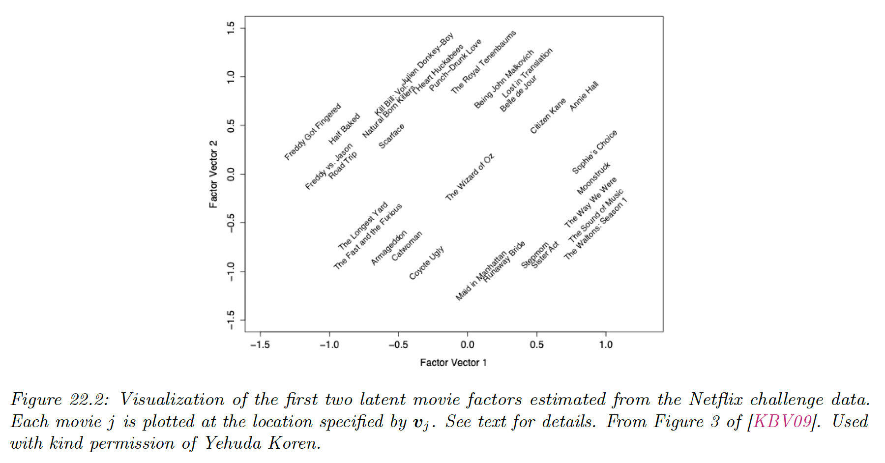
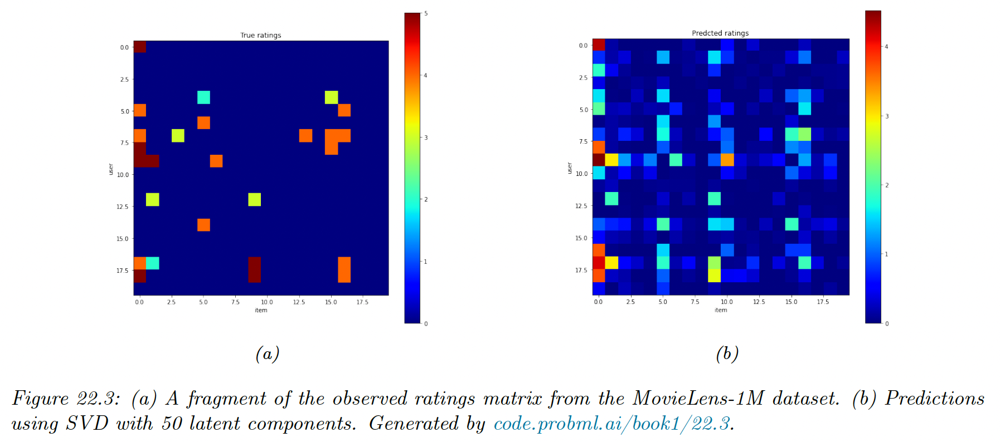
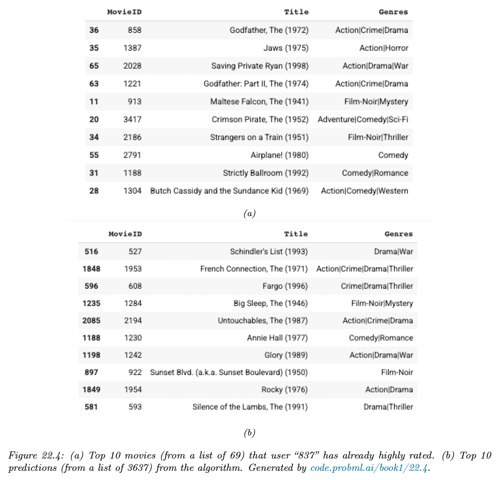

# 22.1 Explicit feedback

We consider the simplest setting in which the user gives **explicit feedback** in terms of a rating, such as +1 or -1 (for like / dislike) or a score from 1 to 5.

Let $Y\in \R^{M \times N}$ be the rating matrix, for $M$ users and $N$  movies. Typically the matrix will be very large but very sparse since most users will not provide a feedbacks on most items.

We can also view the matrix as a bipartite graph, where the weight of the $u-i$ edge is $Y_{ui}$. This reflects that we are dealing with **relational data**, i.e. the values of $u$ and $i$  don’t have intrinsic meaning (they are just indices), it is the fact that $i$ and $j$ are connected that matters.

If $Y_{ui}$ is missing, it could be that user $u$ didn’t interact with item $i$, or that they knew they wouldn’t like it and choose not to engage with it. In the former case, the data is **missing at random** whereas in the second the missingness is informative about the true value of $Y_{ui}$.

We will assume that data is missing at random for simplicity.

### 22.1.1 Datasets

In 2006, Netflix released a large dataset of 100m movie ratings (from a scale of 1 to 5) from 480k users on 18k movies. Despite its large size, the matrix is 99% sparse (unknown).

The winning team used a combination of techniques, see [Lessons from the Netflix Challenge](https://citeseerx.ist.psu.edu/document?repid=rep1&type=pdf&doi=1e96b0c0ac74070a984fec94f085109839d842a9).

The Netflix dataset is not available anymore, but the **MovieLens** group has released an anonymized public dataset of movie ratings, on a scale of 1-5, that can be used for research. There are also the **Jester** jokes and the **BookCrossing** datasets.

### 22.1.2 Collaborative filtering

The original approach to the recommendation problem is called **collaborative filtering**. The idea is that users collaborate on recommending items by sharing their ratings with other users.

Then, if $u$ wants to know if they interact with $i$, they can see what ratings other users $u'$ have given to $i$, and take a weighted average:

$$
\hat{Y}_{ui}=\sum_{u':Y_{u'i}\neq ?}\mathrm{sim}(u,u')Y_{u'i}
$$

where we assume $Y_{iu}=?$ if the entry is unknown.

The traditional approach measured the similarity of two users by comparing the sets $S_u=\{Y_{u,i}\neq ? : i\in\mathcal{I}\}$ and $S_{u'}=\{Y_{u',i}\neq ?:i\in \mathcal{I}\}$, where $\mathcal{I}$ is the set of items.

However, this can suffer from data sparsity. Below, we discuss about learning dense embedding for users and items, so that we are able to compute similarity in a low dimensional feature space.

### 22.1.3 Matrix factorization

We can view the recommender problem as one of **matrix completion**, in which we wish to predict all the missing entries of $Y$. We can formulate this as the following optimization problem:

$$
\mathcal{L}(Z)=\sum_{ij:Y_{ij}\neq ?} (Z_{ij}-Y_{ij})^2=||Z-Y||_F^2
$$

However, this is an under-specified problem, since there are an infinite number of ways of filling in the missing entries of $Z$.

We need to add some constraints. Suppose we assume that $Y$ is low-rank. Then we can write it in the form:

$$
Y=UV^\top
$$

where $U\in \R^{M\times K}$ and $V\in \R^{N \times K}$, $K$ is the rank of the matrix.

This corresponds to a prediction of the form:

$$
\hat{y}_{ui}=\bold{u}_u^\top\bold{v}_i
$$

This is called **matrix factorization**.

If we observe all $Y_{ij}$ entries, we can find the optimal $Z$ using SVD. However, when $Y$ has missing entries, the corresponding objective is no longer convex, and doesn’t have a unique optimum.

We can fit this using [**alternative least square (ALS)**](https://datajobs.com/data-science-repo/Recommender-Systems-[Netflix].pdf), where we estimate $U$ given $V$ and then $V$  given $U$. Alternatively, we can use SGD.

In practice, it is important to also follow for user-specific and item-specific baselines, by writing:

$$
\hat{y}_{ui}=\mu +b_u+c_i+\bold{u}_u^\top \bold{v}_i
$$

This can capture the fact that some users tend to give low or high ratings, and some items may have unusually high ratings.

In addition, we can add some $\ell_2$ regularization to the parameters to get the objective:

$$
\mathcal{L}(\theta)=\sum_{ui:Y_{ui}\neq ?}(y_{ui}-\hat{y}_{ui})^2+\lambda(b^2_u+c_i^2+||\bold{u}_u||^2+||\bold{v}_i||^2)
$$

We can optimize using SGD by sampling an entry $(u,i)$ from the set of observed values, and performing the update:

$$
\begin{align}
b_u &= b_u+\eta(e_{ui}-\lambda b_u) \\
c_i &= c_i+\eta(e_{ui}-\lambda c_i) \\
\bold{u}_u &= \bold{u}_u+\eta (e_{ui}\bold{v}_i-\lambda \bold{u}_u) \\
\bold{v}_i &= \bold{v}_i+\eta (e_{ui}\bold{u}_u-\lambda \bold{v}_i)
\end{align}
$$

where $e_{ui}=y_{ui}-\hat{y}_{ui}$ is the error term, and $\eta\geq 0$ is the learning rate.

This approach was first introduced by Simon Funk, [who was one of the first to do well in the early days of the Netflix challenge](https://sifter.org/~simon/journal/20061211.html).

#### 22.1.3.1 Probabilistic matrix factorization (PMF)

We can convert matrix factorization into a probabilistic model by defining:

$$
p(y_{ui}=y)=\mathcal{N}(y|\mu+b_u+c_i+\bold{u}_u^\top \bold{v}_i,\sigma^2)
$$

This is known as **probabilistic matrix factorization (PMF)**.

The NLL is equivalent to the matrix factorization objective. However, the probabilistic perspective allows us to generalize the model more easily.

For example, we can capture the fact that ratings are positive integers (mostly zeros) instead of reals by using a Poisson or negative Binomial likelihood.

#### 22.1.3.2 Example: Netflix

We apply PMF to the Netflix dataset using $K=2$ latent factors. The figure below visualizes some learning embedding vectors $\bold{v}_i$.

Left is humor and horror movies, while movies on the right are more serious. Top is critically acclaimed independent movie and on the bottom mainstream Hollywood blockbusters.

Users are embedded into the same space as movies, we can then predict the rating for any user-video pair using proximity in the latent embedding space.

#### 22.1.3.3 Example: MovieLens

We apply PMF to the MovieLens-1M dataset with 6k users, 3k movies and 1m ratings. We use $K=50$ factors.

For simplicity, we fit this using SVD applied to the dense ratings matrix, where we replace the missing values with 0. We truncate the predictions so that they lie in the range $[1, 5]$.

We see that the model is not particularly accurate but it captures some structure in the data.

Furthermore, it seems to behave in a qualitatively sensible way. Below, we show the top 10 movies rated by a user and show the top 10 predictions for movies they had not seen.

Without giving explicit informations, the model captured the underlying preference for action and film-noir.

### 22.1.4 Autoencoders

Matrix factorization is a (bi)linear model. We can make it nonlinear using autoencoders.

Let $\bold{y}_{:,i}\in \R^M$ be the $i$th column of the rating matrix, where unknown ratings are set to 0.

We can predict this ratings vector using an autoencoder of the form:

$$
f(\bold{y}_{:,i};\theta)=W^\top \varphi(V\bold{y}_{:,i}+\mu)+\bold{b}
$$

where $V\in \R^{KM}$ maps the ratings to the embedding space, $W\in \R^{KM}$ maps the embedding space to a distribution over ratings, $\mu \in \R^K$ are the biases of the hidden units, $\bold{b}\in \R^M$ are the biases of the output units and $\varphi$ is the sigmoid activation function.

This is called the item-based version of the [**AutoRec**](https://users.cecs.anu.edu.au/~akmenon/papers/autorec/autorec-paper.pdf) model. This has $2MK+K+M$ parameters.

There is also a user-based version with $2NK+K+N$ parameters, but on both MovieLens and Netflix, the authors find the item-based version works better.

We can fit this by only updating parameters that are associated with the observed entries of $\bold{y}_{:,i}$, and add a $\ell_2$ regularizer to get the objective:

$$
\mathcal{L}(\theta)=\sum_{i=1}^N \sum_{u:y_{ui}\neq ?}(y_{ui}-f(\bold{v}_{:,i};\theta)_u)^2+\frac{\lambda}{2}(||W||_F^2+ ||V||_F^2)
$$

Despite the simplicity of the method, authors find that this does better than restricted Boltzmann machines (RBMs) and local low-rank matrix (LLORMA).