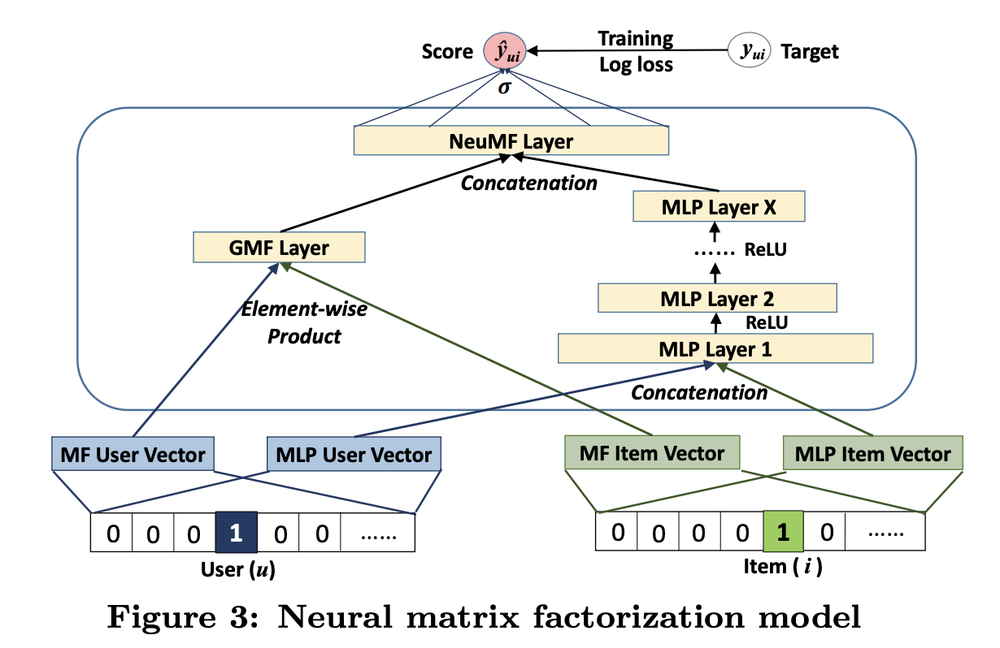

# 22.2 Implicit feedback

So far, we have assumed that the user gives explicit ratings for each item they interact with, which is very restrictive.

More generally, we would like to learn from the implicit feedback that users give by interacting with a system. For instance, we could treat all movies watched by a user as positive, and all the others as negative. We end-up with a sparse, positive-only ratings matrix.

Alternatively, we can consider a user watching item $i$ but not item $j$ as an implicit signal that they prefer $i$  over $j$
. The resulting data can be represented as a set of tuples $y_n=(u,i,j)$, where $(u,i)$ is a positive pair, and $(u,j)$ is a negative, unlabeled pair.

### 22.2.1 Bayesian personalized ranking

To fit a model of the form $(u,i,j)$, we need to use a **ranking loss**, so that the model ranks $i$ ahead of $j$ for user $u$.

A simple way to do it is to use a Bernoulli form of the data:

$$
p(y_n=(u,i,j)|\theta)=\sigma(f(u,i;\theta)-f(u,j;\theta))
$$

If we combine this with a Gaussian prior for $\theta$, we get the following MAP estimation problem:

$$
\mathcal{L}(\theta)=\sum_{(u,i,j)\in\mathcal{D}} \log \sigma(f(u,i;\theta)-f(u,j;\theta))-\lambda||\theta||^2
$$

where $\mathcal{D}=\{(u,i,j):i\in \mathcal{I}^+_u,j\in \mathcal{I}\backslash \mathcal{I}^+_u\}$, where $\mathcal{I}^+_u$ is the set of items user $u$ selected, and $\mathcal{I}$ are all the items.

This is known as **Bayesian personalized ranking (BPR)**.

As an example, if $\mathcal{I}=\{i_1,i_2,i_3,i_4\}$ and the user $u$ chose to interact with $\mathcal{I}^+=\{i_2,i_3\}$, we get the following implicit item-item preference matrix:

$$
Y_u=
\begin{bmatrix}
. & - & - &? \\
+ & . & ? & + \\
+ & ? & . & + \\
? & - & - & .

\end{bmatrix}
$$

where $Y_{u,i,i'}=+$ means user $u$ prefer item $i$ over $i'$, and $?$ means that we can’t determine its preferences.

When the set of possible items is large, the number of negative in $\mathcal{I} \backslash \mathcal{I}^+_u$ can be large. Fortunately, we can approximate the loss by subsampling negatives.

Note that an alternative to the log-loss above is to use the hinge loss, similar to the approach used for SVMs:

$$
\mathcal{L}(y_n=(u,i,j),f)=\max(0,f(u,j)-f(u,i)+m)
$$

where $m\geq 0$  is the safety margin. This ensures the negative items $j$  never scores more than $m$ higher than the positive items $i$.

### 22.2.2 Factorization machines

The AutoRec approach of section 22.1.4 is nonlinear but treats users and items asymmetrically.

We start with a linear and symmetrical discriminative approach, by predicting the output (such as a rating) of a user-item one-hot-encoded pair:

$$
f(\bold{x})=\mu+\sum_{i=1}^D w_i x_i+\sum_{i=1}^D\sum_{j=i+1}^D (\bold{v}_i^\top \bold{v}_j)x_ix_j
$$

where $\bold{x}=[\mathrm{onehot}(u), \mathrm{onehot}(i)]\in\R^D$, $D=M+N$ is the number of inputs, $V\in\R^{D\times K}$ is a weight matrix, $\bold{w}\in \R^D$ is a weight vector, and $\mu$ is a global offset.

This is known as a **factorization machine (FM),** and is a generalization of the equation in section 22.1.3:

$$
f(\bold{x})=\mu+b_u+c_i+\bold{u}_u^\top \bold{v}_i
$$

since $(\bold{v}_i^\top \bold{v}_j)x_ix_j$ can handle information beyond user and item.

Computing the generalized equation takes $O(D^2K)$ time since it considers all pairwise interactions between users and items.

Fortunately, we can rewrite this to compute it in $O(DK)$ as follows:

$$
\begin{align}
\sum_{i=1}^D\sum_{j=i+1}^D(\bold{v
}_i^\top\bold{v}_j)x_ix_j&= \frac{1}{2}\sum_{i=1}^D\sum_{j=1}^D (\bold{v
}_i^\top\bold{v}_j)x_ix_j -\frac{1}{2}\sum_{i=1}^D \bold{v}_i^\top \bold{v}_ix_ix_i \\
&= \frac{1}{2}\sum_{i=1}^D\sum_{j=1}^D \sum_{k=1}^K v_{ik}
v_{kj} x_ix_j -\frac{1}{2}\sum_{i=1}^D \sum_{k=1}^K v_{ik}v_{ik}x_ix_i \\
&= \frac{1}{2}\sum_{k=1}^K\Bigg[\Big(\sum_{i=1}^D v_{ik}x_i\Big)^2-\sum_{i=1}^D (v_{ik}x_i)^2\Bigg]
\end{align}
$$

For sparse vectors, the complexity is linear in the number of nonzero components, so here it is just $O(K)$.

We can fit this model to minimize any loss we want, e.g., MSE loss if we have explicit feedbacks, ranking loss if we have implicit feedbacks.

**Deep factorization machines** combine the above with an MLP applied to a concatenation of the embedding vectors, instead of the inner product. The model has the form:

$$
f(\bold{x})=\sigma(\mathrm{FM}(\bold{x})+\mathrm{MLP}(\bold{x}))
$$

The idea is that the bilinear FM model captures explicit interactions between users and features, while the MLP captures implicit relation between user features and item features, which allows the model to generalize.

### 22.2.3 Neural matrix factorization

The [**Neural matrix factorization](https://arxiv.org/abs/1708.05031)** model is another way to combine bilinear model with neural nets.

The bilinear part is used to define the generalized matrix factorization (GMF) pathway, which computes the following feature for user $u$ and item $i$:

$$
\bold{z}_{ui}^1=P_{u,:}\odot Q_{i,:}
$$

where $P\in \R^{M\times K }$ and $Q\in \R^{N\times K }$ are user and item embedding matrices.

The DNN part is a MLP applied to the concatenation of other embedding vectors:

$$
\bold{z}_{ui}^2=\mathrm{MLP}([\tilde{U}_{u,:},\tilde{V}_{i,:}])
$$

Finally, the model combines these to get:

$$
f(u,i;\theta)=\sigma(\bold{w}^\top[\bold{z}^1_{ui},\bold{z}_{ui}^2])
$$

The model is trained on implicit feedback, where $y_{ui}=1$ if the interaction is observed, $0$ otherwise. However it could be trained to minimize BPR loss.