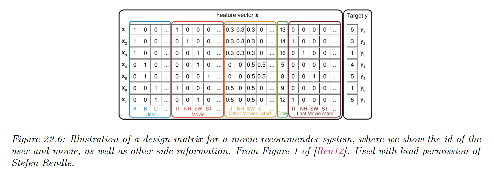

# 22.3 Leveraging side information

So far, we have assumed that the only information available to the predictor are the id of the user and the id of the item.

This is an extremely impoverished representation, and will fail to work if we encounter a new user or a new item (the **cold start** problem). To overcome this, we need to leverage “side information”.

For items, we often have rich meta-data, such as text (titles, descriptions), images, high-dimensional categorical variables (e.g. location), or scalar (e.g. price).

For users, the side information depends on the specific form of the interactive system.

- For search engines, it is the list of queries the user has issued, and information derived from websites they have visited (tracked by cookies).
- For online shopping sites, it is the list of searches plus past viewing and purchasing behavior.
- For social network, there is information about the friendship graph of each user.

It is very easy to capture this side information in the factorization machines framework, by expanding our definition of $\bold{x}$ beyond the two one-hot vectors.

In addition to features about the user and item, there may be other contextual features, such as the time of interaction. The sequence of the most recently viewed items is often also a useful signal.

The **Covolutional Sequence Embedding Recommendation (Caser)** captures this by embedding the last $M$ items, and then treating the $M\times K$ input as an image, by using a covolutional layer as part of the model.

See [this review](https://arxiv.org/abs/1707.07435).