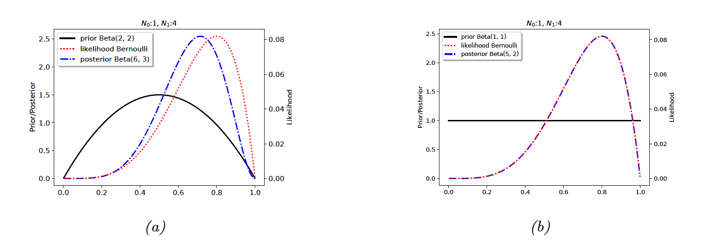
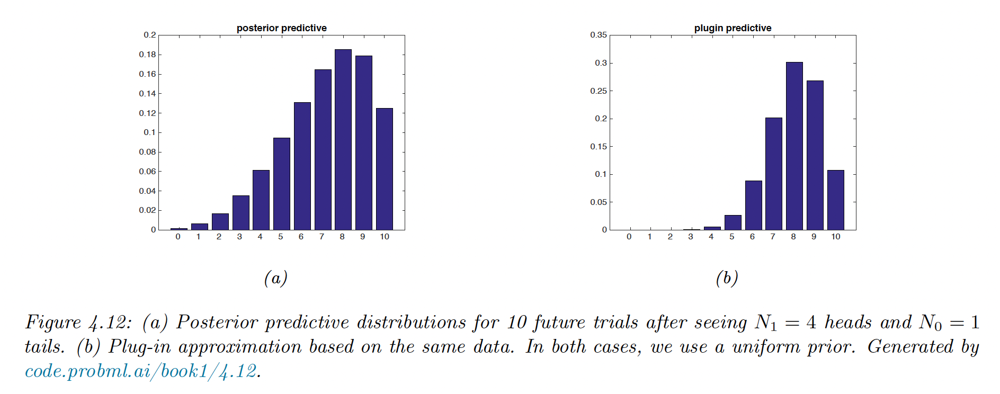
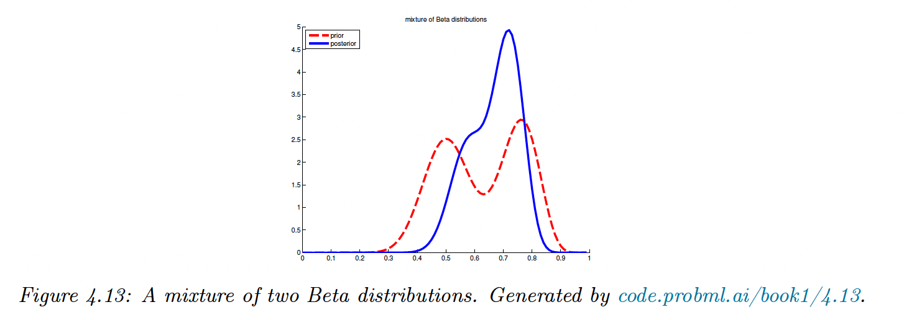
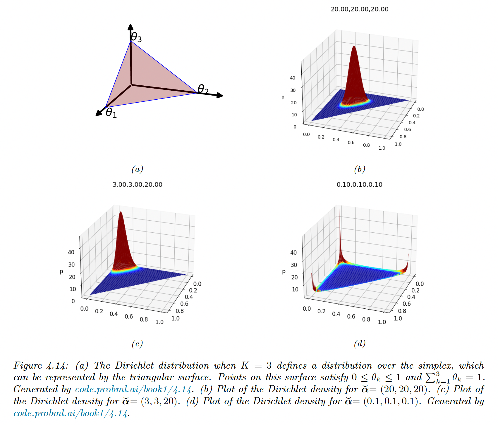
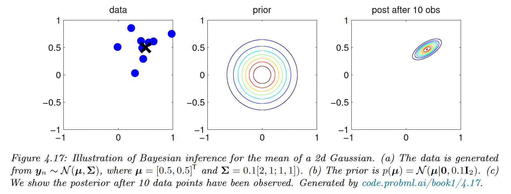
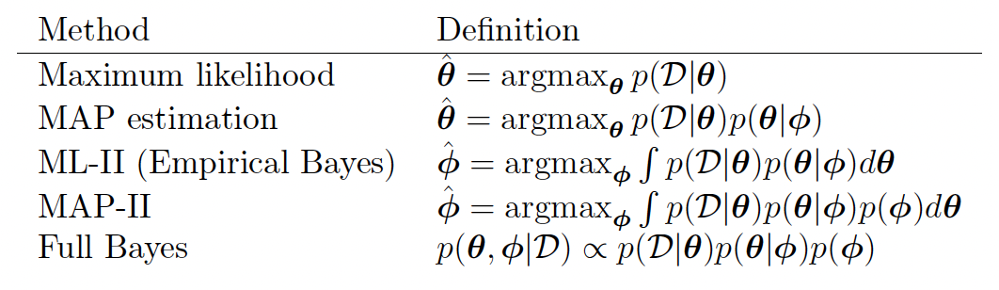
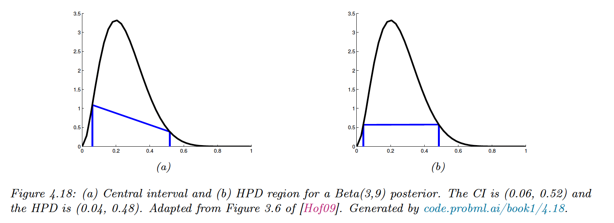
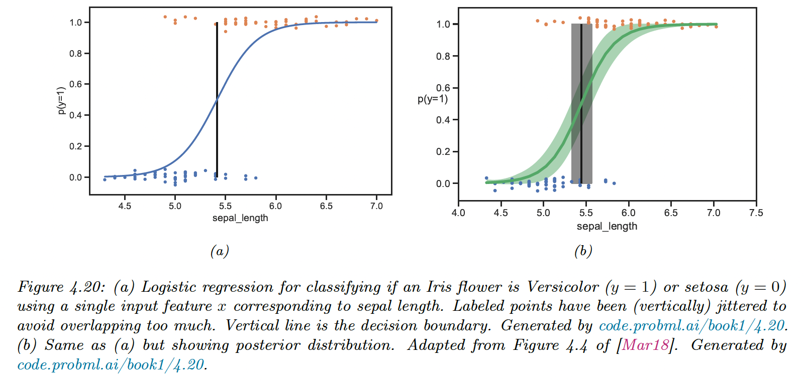
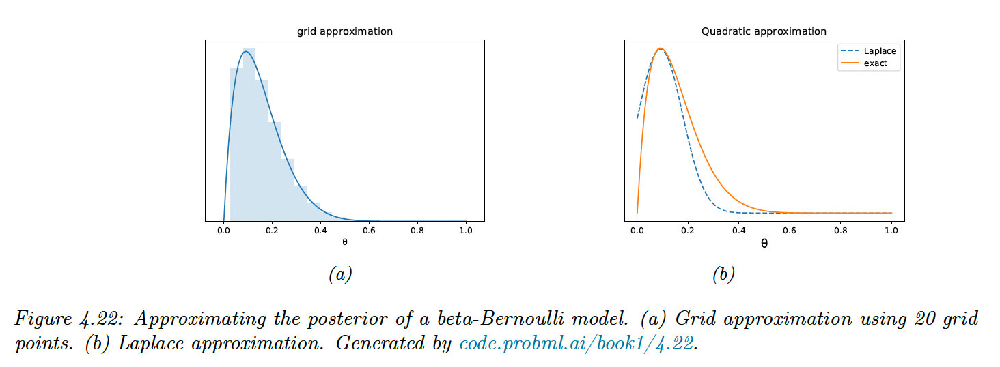

# 4.6 Bayesian statistics

Inference is modeling uncertainty about parameters using a probability distribution (instead of a point estimate). In Bayesian statistics we use the posterior distribution.

$$
p(\theta|\mathcal{D})=\frac{p(\mathcal{D}|\theta)p(\theta)}{p(\mathcal{D})}
$$

Once we have computed the posterior over $\theta$, we compute the posterior predictive distribution by marginalizing out $\theta$. In the supervised setting:

$$
p(y|x,\mathcal{D})=\int p(y|x,\theta)p(\theta|\mathcal{D})d\theta
$$

This is Bayes model averaging (BMA), since we use an infinite amount set of models, weighted by how likely their parameters are.

### 4.6.1 Conjugate prior

A prior $p(\theta)\in\mathcal{F}$ is conjugate for a likelihood function $p(\mathcal{D}|\theta)$ if the posterior $p(\theta|\mathcal{D})\in\mathcal{F}$. The family $\mathcal{F}$ is closed under bayesian updating.

For simplicity, we consider a model without covariates.

### 4.6.2 Beta-binomial model

**4.6.2.1 Bernoulli likelihood**

We toss a coin $N$ times to estimate the head probability $\theta$. We want to compute $p(\theta|\mathcal{D})$.

Under the iid hypothesis:

$$
p(\mathcal{D}|\theta)=\theta^{N_1}(1-\theta)^{N_0}
$$

**4.6.2.2 Binomial likelihood**

Instead of observing a sequence of coin toss, we can count the number of heads using a binomial likelihood

$$
p(\mathcal{D}|\theta)=\mathrm{Bin}(y|N,\theta)=\binom{N}{y}\theta^{y}(1-\theta)^{N-y}
$$

Since these likelihood are proportional, we will use the same inference about $\theta$ for both models.

**4.6.2.3 Prior**

The Beta distribution is the conjugate prior to Bernoulli or Binomial likelihood.

$$
p(\theta)=\mathrm{Beta}(\theta|a,b)=\theta^{a-1}(1-\theta)^{b-1}
$$

**4.6.2.4 Posterior**

If we multiply the Bernoulli likelihood with the Beta prior, we obtained the following posterior:

$$
\begin{align}
p(\theta|\mathcal{D})&=\theta^{a-1+N_1}(1-\theta)^{b-1+N_0} \\
&=\mathrm{Beta}(\theta|a+N_1,b+N_0) \\
&=\mathrm{Beta}(\theta|\breve{a},\breve{b})
\end{align}

$$

Here the hyper-parameters of the prior $a,b$ play an similar role to the sufficient statistics $N_1,N_0$. We call $a,b$ pseudo counts and $N_1,N_0$ observed counts.

**4.6.2.5 Example**

If we set $a=b=2$, it would means that we have already observed 2 heads and 2 tails before we see the actual data. This is a weak preference for the value of $\theta=0.5$ (small update in figure (a) below).

If we set $a=b=1$, the prior become $p(\theta)=\theta^{0}(1-\theta)^0=\mathrm{Unif}(\theta|0,1)$. The prior is uninformative, so there is no update.

**4.2.2.6 Posterior mode (MAP estimate)**

Similarly to the MAP estimate already we saw in the regularization section, we have

$$
\hat{\theta}_{map}=\frac{a+N_1-1}{a+b+N-2}
$$

If we use $a=b=2$, we find back the add-one smoothing.

If we use $a=b=1$, we have $\hat{\theta}_{map}=\hat{\theta}_{mle}$

**4.6.2.7 Posterior mean**

The **posterior mean** is a more robust estimation than the posterior mode since it integrates over the whole space (instead of a single point).

If $p(\theta|\mathcal{D})=\mathrm{Beta}(\theta|\breve{a},\breve{b})$, the posterior mean is:

$$
\bar{\theta} \triangleq \mathbb{E}[\theta|\mathcal{D}]=\frac{\breve{a}}{\breve{N}}
$$

with $\breve{N}=\breve{a}+\breve{b}$ the strength of the posterior.

The posterior mean is a convex combination of the prior mean, $m=\frac{a}{N_{ab}}$ and the MLE: $\hat{\theta}_{mle}=\frac{N_1}{N}$

$$
\begin{align}
\mathbb{E}[\theta|\mathcal{D}]&=\frac{a+N_1}{a+b+N_1+N_0}\\
&=\frac{N_{ab}}{N+N_{ab}}\frac{a}{N_{ab}}+\frac{N}{N+N_{ab}}\frac{N_1}{N} \\
&= \lambda m+(1-\lambda)\hat{\theta}_{mle}
\end{align}
$$

**4.6.2.8 Posterior variance**

The variance of a Beta posterior is given by:

$$
\mathbb{V}[\theta|\mathcal{D}]=\frac{\breve{a}\breve{b}}{(\breve{a}+\breve{b})^2(\breve{a}+\breve{b}+1)}\approx \frac{N_1N_0}{N^3}=\frac{\theta(1-\theta)}{N}
$$

Thus, the standard error of our estimate (aka the **posterior variance**) is:

$$
se(\theta)=\sqrt{\mathbb{V}[\theta|\mathcal{D}]}=\sqrt{\frac{\theta(1-\theta)}{N}}
$$

**4.6.2.9 Posterior predictive**

For the Bernoulli distribution, the **posterior predictive distribution** has the form:

$$
\begin{align}
p(y=1|\mathcal{D})&=\int^1_0 p(y=1|\theta)p(\theta|\mathcal{D})d\theta \\
&= \int^1_0\theta\, \mathrm{Beta} (\theta|a,b)d\theta \\
&= \mathbb{E}[\theta|\mathcal{D}] \\
&= \frac{\breve{a}}{\breve{a}+\breve{b}}
\end{align} 
$$

For the Binomial distribution, the posterior predictive distribution has the form of the Beta-Binomial distribution:

$$
\begin{align}
p(y|\mathcal{D},M)&=\int^1_0\mathrm{Bin}(y|M,\theta)\,\mathrm{Beta}(\theta|\breve{a},\breve{b})d\theta \\
&= \binom{M}{y}\frac{1}{\Beta(\breve{a},\breve{b})}\int^1_0\theta^y(1-\theta)^{M-y}\theta^{\breve{a}-1}(1-\theta)^{\breve{b}-1}d\theta \\
&=\binom{M}{y}\frac{\Beta(y+\breve{a},M-y+\breve{b})}{\Beta(\breve{a},\breve{b})} \\
&\triangleq \mathrm{Bb}(y|M,\breve{a},\breve{b})
\end{align}
$$

We plot in figure (a) below the posterior predictive distribution for $M=10,N_1=4,N_0=1$, with a uniform prior $\mathrm{Beta}(\theta|1,1)$.

(Remember that $\breve{a}=a+N_1$ and $\breve{b}=b+N_0$)

We plot in figure (b) the plugin approximation, where $\hat{\theta}_{map}$ is directly injected into the likelihood: $p(y|\mathcal{D},M)=\mathrm{Bin}(y|M,\hat{\theta}_{map})$

The long tail of the Bayesian approach is less prone to overfitting and Black Swan paradoxes. In both case, the prior is uniform, so this Bayesian property is due to the integration over unknown parameters.

**4.6.2.10 Marginal likelihood**

The **marginal likelihood** for a model $\mathcal{M}$ is defined as:

$$
p(\mathcal{D|M})=\int p(\mathcal{D}|\theta,\mathcal{M})p(\theta|\mathcal{M})d\theta
$$

Since it is constant in $\theta$, it is not useful for parameter inference, but can help for model or hyperparameters selection (aka Empirical Bayes)

The marginal likelihood for the Beta Binomial is:

$$
\begin{align}

p(\theta|\mathcal{D})&=\frac{p(\mathcal{D}|\theta)p(\theta)}{p(\mathcal{D})} \\
&= \binom{N}{N_1}\frac{1}{p(\mathcal{D})}\frac{1}{\Beta(a,b)}\theta^{a+N_1-1}(1-\theta)^{b+N_0-1}
\end{align}
$$

so

$$
 \begin{align}
\frac{1}{\Beta(a+N_1, b+N_0)}&=\binom{N}{N_1}\frac{1}{p(\mathcal{D})}\frac{1}{\Beta(a,b)} \\
p(\mathcal{D})&= \binom{N}{N_1}\frac{\Beta(a+N_1,b+N_0)}{\Beta(a,b)}

\end{align}
$$

The marginal likelihood of the Beta Bernoulli is the same as above without the $\binom{N}{N_1}$ term.

**4.6.2.11 Mixture of conjugate priors**

Our current prior is rather restrictive. If we want to represent a coin that may be fair but also be equally biased towards head. We can use a Mixture of beta distributions:

$$
p(\theta)=0.5\,\mathrm{Beta}(20,20)+0.5\,\mathrm{Beta}(30,10)
$$

We introduce $h=k$ meaning that $\theta$ comes from mixture $h$, so the mixture prior is:

$$
p(\theta)=\sum_k p(h=k)p(\theta|h=k)
$$

We can show that the posterior can also be written as a mixture of conjugate distributions:

$$
p(\theta|\mathcal{D})=\sum_k p(h=k|\mathcal{D})p(\theta|\mathcal{D},h=k)
$$

where the posterior mixing weights are:

$$
p(h=k|\mathcal{D})=\frac{p(\mathcal{D}|h=k)p(h=k)}{\sum_{k'}p(\mathcal{D}|h=k')p(h=k')}
$$

We can compute this quantity using the equation (40) of the marginal likelihood. If we observe $N_1=20$ heads and $N_0=10$ tails, the posterior is:

$$
p(\theta|\mathcal{D})=0.346\,\mathrm{Beta}(\theta|40,30)+0.654\,\mathrm{Beta}(\theta|50,20)
$$

We can compute the probability that the coin is biased towards head:

$$
\Pr(\theta>0.5|\mathcal{D})=\sum_k\Pr(\theta>0.5|\mathcal{D},h=k)p(h=k|\mathcal{D})=0.9604
$$

### 4.6.3 The Dirichlet-multinomial model

We generalize the results from binary variable to categories (e.g. dice).

**4.6.3.1 Likelihood**

Let $Y\sim \mathrm{Cat}(\theta)$ be a discrete random variable drawn from categorical distribution. The likelihood has the form:

$$
p(\mathcal{D}|\theta)=\prod^n_{n=1}\mathrm{Cat}(y_n|\theta)=\prod^N_{n=1}\prod^C_{c=1}\theta_c^{\mathbb{I}(y_n=c)}=\prod^C_{c=1} \theta_c^{N_c}
$$

**4.6.3.2 Prior**

The conjugate prior is a Dirichlet distribution, which is a multivariate of a beta distribution. It has support over the probability simplex:

$$
S_K=\{\theta:0\leq\theta_k\leq1, \sum^K_{k=1}\theta_k=1 \}
$$

The pdf of Dirichlet:

$$
\mathrm{Dir}(\theta|\bold{a})=\frac{1}{\Beta(\bold{a})}\prod_{k=1}^K\theta_k^{a_k-1}\mathbb{I}(\theta \in S_K)
$$

with the multivariate Beta function:

$$
\Beta(\bold{a})=\frac{\sum_{k=1}^K\Gamma(a_k)}{\Gamma({\sum_{k=1}^Ka_k})}
$$

**4.6.3.3 Posterior**

The posterior is:

$$
\begin{align} p(\theta|\mathcal{D})&\propto p(\mathcal{D}|\theta)\mathrm{Dir}(\theta|\bold{a}) \\
&= \prod_k \theta_k^{N_k} \prod_k\theta_k^{a_k-1} \\
&= \mathrm{Dir}(\theta|a_1+N_1,...,a_K+N_k)\\
&= \mathrm{Dir}(\theta|\breve{\bold{a}})
\end{align} 
$$

The posterior mean is:

$$
\bar{\theta}_k=\frac{\breve{a}_k}{\sum^K_{k'=1}\breve{a}_{k'}}
$$

The posterior mode (which corresponds to the MAP) is:

$$
\hat{\theta}_k=\frac{\breve{a}_k-1}{\sum_{k'=1}^K(\breve{a}_{k'}-1)}
$$

If $a_k=1$, corresponding to a uniform prior, the MAP becomes the MLE:

$$
\theta_k=\frac{N_k}{N}
$$

**4.6.3.4 Posterior predictive**

The posterior predictive distribution is given by:

$$
\begin{align}
p(y=k|\mathcal{D}) &= \int p(y=k|\theta)p(\theta |\mathcal{D})d\theta \\
&= \int \theta_k p(\theta_k|\mathcal{D})d\theta_k 
= \mathbb{E}[\theta_k|\mathcal{D}]=\frac{\breve{a}_k}{\sum_{k'}\breve{a}_{k'}}
\end{align}
$$

For a batch of data to predict (instead of a single point), it becomes

$$
p(\bold{\tilde{y}|y})=\frac{p(\bold{y,\tilde{y}})}{p(\bold{y})}
$$

Where the denominator and the numerator are marginal likelihoods on the training and training + future test data.

**4.6.3.5 Marginal likelihood**

The marginal likelihood of the Dirichlet-categorical are given by:

$$
p(\mathcal{D})=\frac{\Beta(\bold{a}+N)}{\Beta(\bold{a})}
$$

### 4.6.4 Gaussian-Gaussian model

We derive the posterior for the parameters for a Gaussian distribution, assuming that the variance is known for simplicity.

**4.6.4.1 Univariate case**

We can show that the conjugate prior is also Gaussian. We then apply the Bayes rule for Gaussian, with the observed precision $\kappa$ and the prior precision $\lambda$. The posterior is:

$$
\begin{align}
p(\mu|\mathcal{D},\kappa^{-1}) &= \mathcal{N}(\mu|\breve{m},\breve{\lambda}^{-1}) \\
\breve{\lambda} &= \lambda +N \kappa \\
\breve{m} &= \frac{N \kappa \bar{y}+\lambda m}{\breve{\lambda}}=\frac{N \kappa}{\lambda+N\kappa}\bar{y}+\frac{\lambda}{\lambda+N\kappa}m
\end{align}
$$

The posterior mean is a convex combination of the empirical mean and the prior mean. 

To gain more intuition, after seeing $N=1$ point, our posterior mean is:

$$
\begin{align}
\breve{m} &=\frac{\kappa}{\breve{\lambda}}y+\frac{\lambda}{\breve{\lambda}}m \\
&= m + \frac{\kappa}{\breve{\lambda}}(y-m) \\
&= y-\frac{\lambda}{\breve{\lambda}}(y-m)
\end{align}
$$

The second equation is the prior mean adjusted towards the data y. 

The third equation is the data adjusted towards the prior mean, called a shrinkage estimate.

For a Gaussian estimate the posterior mean and posterior mode are the same, thus we can use the above equations to perform MAP estimation.

If we set an uninformative prior $\lambda=0$ and approximate the observed variance $\sigma^2$ by

$$
s^2=\frac{1}{N}\sum_{n=1}^N(y_n-\bar{y})
$$

then the **posterior variance** of our mean estimate is:

$$
se(\mu)=\sqrt{\mathbb{V}[\mu|\mathcal{D}]}=\frac{1}{\sqrt{\breve{\lambda}}}=\frac{s}{\sqrt{N}}
$$

We see that uncertainty in $\mu$ reduces at the rate $1/\sqrt{N}$.

Because 95% of the Gaussian distribution is contained within 2 standard deviations of the mean, the 95% **credible interval** for $\mu$ is:

$$
I_{.95}(\mu|\mathcal{D})=\bar{y} ± 2\frac{s}{\sqrt{N}}
$$

**4.6.4.2 Multivariate case**

For $D$-dimensional data, the likelihood has the form:

$$
\begin{align}
p(\mathcal{D}|\mu)&=\prod_{n=1}^N \mathcal{N}(\bold{y}_n|\mu,\Sigma) \\
&= \frac{N}{(2\pi)^{D/2}|\Sigma|^{1/2}}\exp\big( -\frac{1}{2}\sum_{n=1}^N(\bold{y}_n-\mu)^\top\Sigma^{-1}(\bold{y}_n-\mu) \big) \\
&= \mathcal{N}(\bold{\bar{y}}|\mu,\frac{1}{N}\Sigma)
\end{align}
$$

Thus we replace the set of observations with their mean and scale down the covariance. 

We obtain the same expression for the posterior of the mean than in the univariate case.

### 4.6.5 Beyond conjugate priors

For most models, there is no prior in the exponential family that conjugates to the likelihood. We briefly discuss various other kinds of prior.

**4.6.5.1 Non informative prior**

When we have little to no domain specific knowledge, we prefer “let the data speak for itself” (we get closer to the frequentist statistics).

We can for example use a flat prior $p(\mu) \propto1$, which can be viewed as an infinitely wide Gaussian.

**4.6.5.2 Hierarchical prior**

The parameters of the prior $p(\theta)$ are called hyper-parameters $\phi$. If there are unknown, we can put a prior on them: this defines a hierarchical Bayesian model.

 If we set a non informative prior on $\phi$, the joint distribution has the form:

$$
p(\phi,\theta,\mathcal{D})=p(\mathcal{D}|\theta)p(\theta|\phi)p(\phi)
$$

We aim at learning $\phi$ by treating the parameters as data points. This is useful when we want to estimate multiple related parameters from different subpopulations.

**4.6.5.3 Empirical prior**

The joint distribution of the hierarchical prior can be challenging to compute.

Instead, we make a point wise estimation of the hyper-parameters by maximizing the marginal likelihood:

$$
\hat{\phi}_{mml}(\mathcal{D})=\argmax _{\phi}p(\mathcal{D}|\phi)=\argmax_{\phi}\int p(\mathcal{D}|\theta)p(\theta|\phi)d\theta
$$

We then compute the conditional posterior $p(\theta|\hat{\phi},\mathcal{D})$ in the usual way.

This violates the principle that the prior should be chosen independently of the data, but we can view it as a computationally cheap approximation of the hierarchical prior. 

The more integral one performs, the “more Bayesian” one becomes:

Note that ML-II is less likely to overfit than ML since there are often fewer hyper-parameters $\phi$ than parameters $\theta$.

### 4.6.6 Credible intervals

The posterior distribution is hard to represent in high dimension. We can summarize it via a point estimate (posterior mean or mode) and compute the associated credible interval (which is different from the frequentist confidence interval).

The Credible Interval for $100(1-\alpha)\%$ is:

$$
C_{\alpha}(\mathcal{D})=(\ell, u):P(\ell \leq \theta \leq u|\mathcal{D})=1-\alpha
$$

If the posterior has a known functional form, we can compute its inverse cdf to find the interval: $\ell=F^{-1}(\alpha/2)$ and $u=F^{-1}(1-\alpha/2)$.

In general, finding the inverse cdf is hard, so instead we rank samples from the posterior distribution and select our target percentiles.

Sometimes, points that are outside the interval have higher density probability than inner points.

We use the **highest posterior density (HPD)** to counter this, by finding the threshold $p^*$:

$$
1-\alpha=\int_{\theta:p(\theta|\mathcal{D})> p^*}p(\theta|\mathcal{D})d\theta
$$

and then defines the HPD as:

$$
C_{\alpha}(\mathcal{D})=\theta:p(\theta|\mathcal{D})\geq p^*
$$

### 4.6.7 Bayesian machine learning

So far, we have focused on unconditional models of the form $p(y|\theta)$.

In supervised machine learning, we focus on conditional models of the form $p(y|x,\theta)$. 

Our posterior becomes $p(\theta|\mathcal{D})$ where $\mathcal{D}=\{(x_n,y_n):n=1:N\}$. This approach is called **Bayesian machine learning**.

**4.6.7.1 Plugin approximation**

Once we have computed the posterior over the $\theta$, we can compute the posterior predictive distribution over $y$ given $x$:

$$
p(y|x,\mathcal{D})=\int p(y|x,\theta)p(\theta|\mathcal{D})d\theta

$$

Computing this integral is often intractable. Instead, we approximate that there is a single best model $\hat{\theta}$, such as the MLE.

$$
p(\theta|\mathcal{D})=\delta(\theta-\hat{\theta})
$$

Using the plugin approximation, the predictive distribution is now:

$$
p(y|x,\mathcal{D})\approx\int p(y|x,\theta)\delta(\theta-\hat{\theta})d\theta=p(y|x,\hat{\theta})
$$

This is the standard machine learning approach of fitting a model $\hat{\theta}$ then making prediction.

However, as this approximation can overfit, we average over a few plausible parameters values (instead of the fully Bayesian approach above). Here are 2 examples:

**4.6.7.2 Example: scalar input, binary output**

To perform binary classification, we can use a logistic regression of the form:

$$
p(y|x,\theta)=\mathrm{Ber}(y|\sigma(w^\top x+b))
$$

In other words:

$$
p(y=1|x,\theta)=\sigma(w^\top x+b)=\frac{1}{1+e^{-w^\top x + b}}
$$

We find the MLE $\hat{\theta}$ for this 1d logistic regression and use the plugin approximation to get the posterior predictive $p(y=1|x,\hat{\theta})$

The decision boundary is defined as:

$$
\sigma(w^\top x^* + b)=1/2 \Rightarrow x^*=-\frac{b}{w}
$$

We capture the uncertainty by approximating the posterior $p(\theta|\mathcal{D})$.

Given this, we can approximate the mean and the 95% credible interval of the posterior predictive distribution using a Monte Carlo approximation:

$$
\begin{align}p(y=1|x,\mathcal{D})&\approx \frac{1}{S}\sum_{s=1}^Sp(y=1|x,\theta_s) \\
C_{\alpha}(x,\mathcal{D}) &= \{\theta_s:p(\theta_s|x,\mathcal{D})> p^*\}
\end{align}
$$

where $\theta_s \sim p(\theta|\mathcal{D})$ is a posterior sample.

We can also compute a distribution over the decision boundary:

$$
p(x^*|\mathcal{D})=\frac{1}{S}\sum_{s=1}^S \delta(x^*-(-\frac{b_s}{w_s}))
$$

where $(b_s,w_s)=\theta_s$

**4.6.7.3 Exemple: binary input, scalar output**

We now predict the delivery time $y$ for a package from company A ($x=0$) or company B

($x=1$).

Our model is:

$$
p(y|x,\theta)=\mathcal{N}(y|\mu_x,\sigma^2_x)
$$

The parameters are $\theta=(\mu_0, \mu_1, \sigma_0, \sigma_1)$ so we can fit this model using MLE.

However, the issue with the plug-in approximation $p(y|x,\hat{\theta})$ is that in the case of one single point of observation, we don’t capture uncertainty, our MLE for standard deviations are $\hat{\sigma}_0=\hat{\sigma}_1=0$.

Instead, the Bayesian approach using the Bayes rule for Gaussian allows to compute the posterior variance and the credible interval.

### 4.6.8 Computational issues

Usually, performing the Bayesian update is intractable except for simple cases like conjugate models or latent variables with few possible values.

We perform approximate posterior inference for a Beta-Bernoulli model:

$$
p(\theta|\mathcal{D})\propto \Bigg[\prod_{n=1}^N \mathrm{Bin}(y_n|\theta)\Bigg] \mathrm{Beta}(\theta | a, b)
$$

with $\mathcal{D}$ consisting in 10 heads and 1 tails, with a uniform prior.

**4.6.8.1 Grid approximation**

The simplest approach is to partition $\theta$ in a finite set $\theta_1,...,\theta_K$ and approximate the posterior by brute-force enumeration:

$$
p(\theta=\theta_k|\mathcal{D})=\frac{p(\mathcal{D} | \theta_k)p(\theta_k)}{\sum_{k'=1}^K p(\mathcal{D}|\theta_{k'})p(\theta_{k'})}
$$

This captures the skewness of our posterior, but the number of grid points scales exponentially in high dimension.

**4.6.8.2 Quadratic (Laplace) approximation**

We approximate the posterior using a multivariate Gaussian as follow:

$$
p(\theta|\mathcal{D}) \approx \frac{1}{Z}e^{-\mathcal{E}(\theta)}
$$

where $Z=p(\mathcal{D})$ is the normalization constant and $\mathcal{E}(\theta)=-\log p(\theta,\mathcal{D})$ is called an energy function.

Performing a Taylor series around the mode $\hat{\theta}$ (i.e. the lowest energy state), we get:

$$
\mathcal{E}(\theta)\approx \mathcal{E}(\hat{\theta})+(\theta-\hat{\theta})^\top \bold{g}+\frac{1}{2}(\theta-\hat{\theta})^\top H(\theta-\hat{\theta})
$$

where $\bold{g}$ is the gradient at the mode and $H$ the Hessian. Since $\hat{\theta}$ is the mode, the gradient is zero.

Hence:

$$
\begin{align}
\hat{p}(\theta,\mathcal{D})&=e^{-\mathcal{E}(\hat{\theta})}\exp\Big[-\frac{1}{2}(\theta-\hat{\theta})^\top H (\theta-\hat{\theta})\Big] \\
\hat{p}(\theta|\mathcal{D}) &= \frac{1}{Z} \hat{p}(\theta,\mathcal{D})=\mathcal{N}(\theta|\hat{\theta},H^{-1}) \\
Z &= e^{-\mathcal{E}(\hat{\theta})}(2\pi)^{D/2}|H|^{-1/2}
\end{align}
$$

The last line follows from the normalization constant of the MVN.

This is easy to apply, since after computing the MAP estimate, we just need to compute the Hessian at the mode (in high dimensional space, we use a diagonal approximation).

However we see that the Laplace approximation fits poorly, because the posterior is skewed whereas Gaussian is symmetric.

Additionally, the parameter of interest lies in the constraint interval $\theta\in[0,1]$ whereas the Gaussian assumes an unconstrained space $\theta\in\R$. This can be solved later by a change of variable $\alpha=\mathrm{logit}(\theta)$.

**4.6.8.3 Variational inference (VI)**

VI is another optimization base posterior approximation. It aims at minimizing some discrepancy $D$ between our posterior distribution $p$ and a distribution $q$ from some tractable family (like MVN):

$$
q^*=\argmin_{q \in \mathcal{Q}} D(q,p)
$$

If $D$ is the KL divergence, we can derivate the evidence lower bound (ELBO) of the marginal likelihood. Maximizing the ELBO improves the posterior approximation.

**4.6.8.4 Markov Chain Monte Carlo (MCMC)**

Although VI is fast, it can give a biased approximation since it is restricted to a specific function form $q\in\mathcal{Q}$.

Monte Carlo is a more flexible, non-parametric approach:

$$
q(\theta)=\frac{1}{S}\sum^S_{s=1}\delta(\theta-\theta_s)
$$

The key issue is to create posterior samples $\theta_s \sim p(\theta|\mathcal{D})$ without having to evaluate the normalization constant $p(\mathcal{D})=\int p(\theta,\mathcal{D})d\theta$

MCMC —and Hamiltonian Monte Carlo (HMC)— speeds up this method by augmenting this algorithm with gradient based information derived from $\nabla \log p(\theta,\mathcal{D})$.