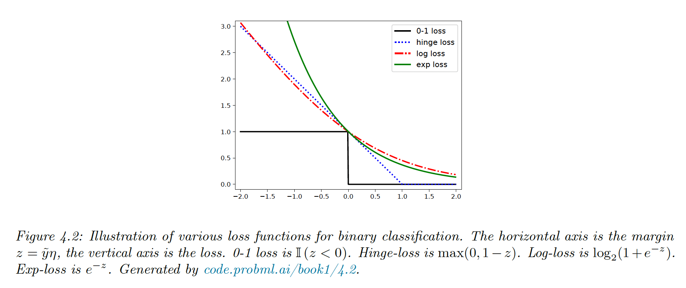

# 4.3 Empirical risk minimization (ERM)

We can generalize the MLE by replacing the loss loss term with any other loss to get:

$$
\mathcal{L}(\theta)=\frac{1}{N}\sum_{n=1}^N\mathcal{l}(y_n,x_n,\theta)
$$

### 4.3.1 Misclassification rate

Let $\tilde{y} \in \{-1,+1\}$ our true label and $\hat{y}\in \{-1,+1\}=f(x,\theta)$ our prediction

We can define the loss as the misclassification rate $l_{01}(\tilde{y},\hat{y})=\mathbb{I}(\tilde{y} \neq \hat{y})=\mathbb{I}(\tilde{y} \hat{y}<0)$

### 4.3.2 Surrogate loss

Unfortunately, the 0-1 loss is non smooth, making it NP-hard to optimize. Here we use a surrogate loss function, a maximally tight convex upper bound, easy to minimize.

For exemple, let 

$$
p(\tilde{y}|x,\theta) = \sigma(\tilde{y}\eta )=\frac{1}{1+e^{-\tilde{y}\eta}}
$$

 where $\eta=f(x,\theta)$ is the logs odds

The log loss is

$$
l(\tilde{y},\eta)=\log(1+e^{-\tilde{y}\eta})
$$

This is a smooth upper bound to the 0-1 loss where $\tilde{y}\eta$ is the margin (it defines a “margin of safety” away from the threshold at 0)

