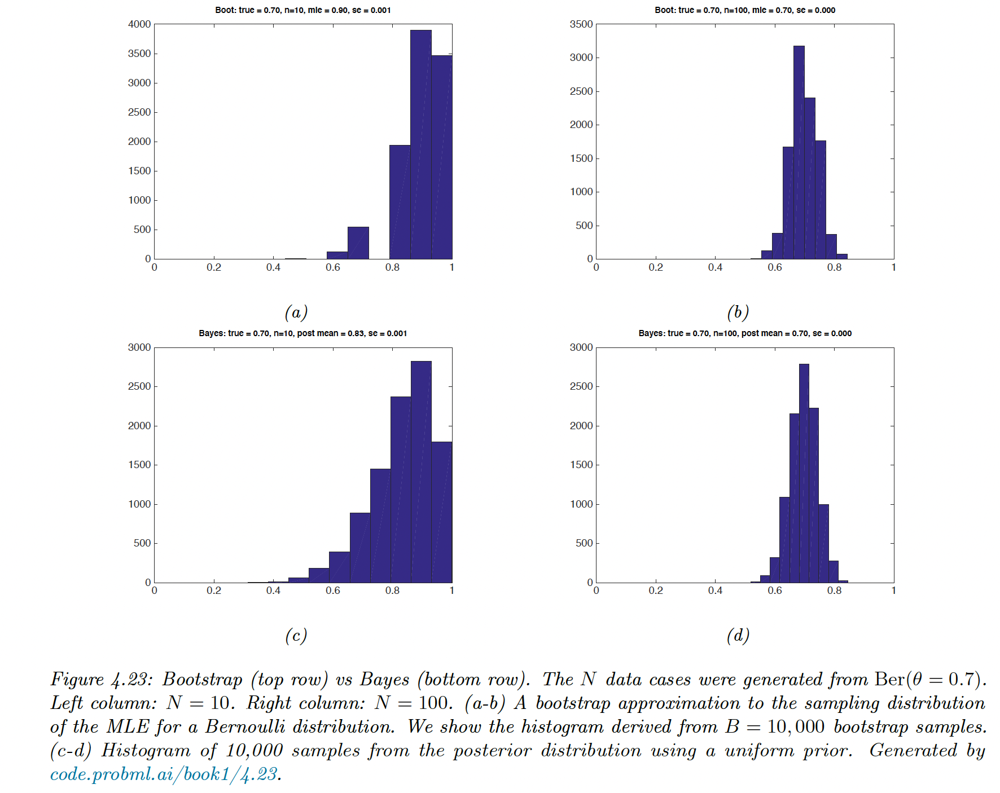

# 4.7 Frequentist statistics

### 4.7.1 Sampling distribution

In frequentist statistics, uncertainty is represented by the sampling distribution on an estimator.

- An **estimator** is a decision procedure mapping observed data to an action (here the action is a parameter vector).
    
    We denote it by $\hat{\theta}=\pi(\mathcal{D})$, where $\hat{\theta}$ can be the MLE, MAP estimate or MOM estimate.
    
- The **sampling distribution** is the distribution of results if we applied the estimator multiple times to different datasets from some distribution
    
    We sample $S$ different datasets of size $N$ from some true model $p(x|\theta^*)$:
    
    $$
    \tilde{\mathcal{D}}^{(s)}=\{x_n \sim p(x_n|\theta^*):n=1:N\}
    $$
    
    For brevity, we denote it $\mathcal{D}^{(s)} \sim \theta^*$
    

If we apply the estimator to each $\mathcal{D}^{(s)}$:

$$
p(\pi(\mathcal{\tilde{D}})=\theta|\mathcal{\tilde{D}}\sim \theta^*) \approx \frac{1}{S} \sum^S_{s=1} \delta (\theta=\pi(\mathcal{D}^{(s)}))
$$

We typically need to approximate it with Monte Carlo.

### 4.7.2 Gaussian approximation of the sampling distribution of the MLE

The most common estimator is the MLE.

When the sample size becomes large, the sampling distribution of the MLE becomes Gaussian:

$$
p(\pi(\mathcal{\hat{D}})=\hat{\theta}|\mathcal{\hat{D}}\sim \theta^*)\rightarrow\mathcal{N}(\hat{\theta}|\theta^*, (N\mathrm{F}(\theta^*))^{-1})
$$

$\mathrm{F}$ is the Fisher information matrix (FIM). It measures the amount of curvature of the log-likelihood at its peak.

$$
\mathrm{F}_{ij}=\mathbb{E}_{x\sim\theta}\Big[\Big(\frac{\partial}{\partial \theta_i} \log p(x|\theta)\Big)(\frac{\partial}{\partial \theta_j}\log p(x|\theta)\Big)^\top\Big]
$$

One can show that the FIM is also the Hessian of the NLL:

$$
\mathrm{F}_{ij}=-\mathbb{E}_{x\sim\theta}\Big[\frac{\partial^2}{\partial \theta_i  \theta_j}\log p(x|\theta)\Big]
$$

A log-likelihood function with high curvature (a large Hessian) will result in a low variance estimate since the parameters are well determined by the data.

### 4.7.3 Bootstrap approximation of the sampling distribution of any estimator

When the estimator is a complex function of the data (not jus the MLE) or when the sample size is small, we can approximate the sampling distribution using a Monte Carlo technique called the bootstrap.

- The parametric bootstrap
    1. Compute $\hat{\theta}= \pi(\mathcal{D})$
    2. Use it as plugin to create $S$ datasets of size $N$: 
        
        $\tilde{\mathcal{D}}^{(s)}=\{x_n\sim p(x_n|\hat{\theta}):i=1:N\}$
        
    3. Compute our estimator for each sample, $\hat{\theta}^{s}=\pi(\hat{\mathcal{D}}^{(s)})$. This empirical distribution is our estimate of the sampling distribution
- The non-parametric bootstrap
    1. Sample $N$ points from $\mathcal{D}$ with replacement, this create $\mathcal{D}^{(s)}$
    2. Compute our estimator as for each sample and draw the empirical distribution.
    
    Note that on average, a sample only has 63.2% of unique data point, since the probability that an item is picked at least once is $(1-(1-1/N)^N)$, which converges to $1-e^{-1}=0.632$
    

The bootstrap is a “poor man’s” posterior. In the common case where the estimator is a MLE and the prior is uniform, they are similar.

### 4.7.4 Confidence intervals

We use the variability induced by the sampling distribution to estimate the uncertainty of an a parameter estimate. We define a $100(1-\alpha)\%$-confidence interval as:

$$
\Pr(\theta\in I(\mathcal{\tilde{D}})|\mathcal{\tilde{D}}\sim \theta)=1-\alpha
$$

where the hypothetical data $\tilde{\mathcal{D}}$ is used to derives the interval $I(\mathcal{\tilde{D}})=(\ell(\mathcal{\tilde{D}}), u(\mathcal{\tilde{D}}))$.

If $\alpha=0.05$, this means that if we repeatedly sample data and compute $I(\mathcal{\tilde{D}})$, 95% of such intervals would contains the parameter $\theta.$

Suppose $\theta^*$  is the unknown true parameter but we know $\Delta=\hat{\theta}-\theta^*$:

$$
\Pr(\delta_{\alpha/2} \leq \hat{\theta}-\theta^*\leq \delta_{1-\alpha/2})=1-\alpha
$$

By rearranging, we find $(\hat{\theta}-\delta_{1-\alpha/2}, \hat{\theta}-\delta_{\alpha/2})$ is a $100(1-\alpha)\%$  CI.

In most cases, we assume a Gaussian approximation to the sampling distribution:

$$
\sqrt{N \mathrm{F}(\hat{\theta})}(\hat{\theta}-\theta^*) \sim N(0, 1)
$$

and thus we can compute and approximate CI using:

$$
\hat{\theta} ± z_{\alpha/2}\hat{se}
$$

where $z_{\alpha/2}$ is the $\alpha/2$ quantile of the Gaussian CDF and $\hat{se}=\sqrt{1/N\mathrm{F}(\hat{\theta}})$ is the estimate standard error.

If the Gaussian approximation is not satisfactory, we can bootstrap the empirical distribution $\hat{\theta}(\mathcal{D})-\hat{\theta}(\mathcal{D}^{(s)})$ as an approximation to $\Delta$.

### 4.7.5 Confidence intervals are not credible

A frequentist 95% CI is defined as an interval such that $\Pr(\theta \in I(\mathcal{\tilde{D}})|\mathcal{\tilde{D}}\sim\theta)=0.95$.

If I repeat the experiment over and over, then 95% of the time the CI contains the true mean.

**It doesn’t mean that the parameter is 95% likely to live in the interval given by the observed data.**

That quantity is instead given by the credible interval $p(\theta \in I|\mathcal{D})$

These concepts are different: in the frequentist view, $\theta$ is treated as a unknown, fixed constant, and the data as random. In the Bayesian view, the data is fixed (as it is known) and $\theta$ is random.

### 4.7.6 The bias-variance tradeoff

In frequentist, data is a random variable drawn from some true but unknown distribution $p^*(\mathcal{D})$. So the estimator has a sampling distribution $p^*(\hat{\theta}(\mathcal{D}))$

The bias is defined as:

$$
\mathrm{bias}(\hat{\theta}(.))\triangleq\mathbb{E}[\hat{\theta}(\mathcal{D})]-\theta^*
$$

The MLE of the Gaussian mean is unbiased $\mathbb{E}[\bar{x}]=\mu$, but **if $\mu$ is not known**, the MLE of the Gaussian variance is biased:

$$
\mathbb{E}[\sigma_{mle}^2]=\mathbb{E}[\frac{1}{N}\sum_{i=1}^N(x_i-\bar{x})^2]=\frac{N-1}{N}\sigma^2
$$

Intuitively, this is because we use up one point to get the mean. The unbiased estimator for the Gaussian variance is:

$$
\sigma^2_{unb}=\frac{1}{N-1}\sum_{i=1}^N(x_i-\bar{x})^2=\frac{N}{N-1}\sigma^2_{mle}
$$

The bias variance tradeoff is given by:

$$
\begin{align}
MSE&=\mathbb{E}[(\hat{\theta}-\theta^*)^2]\\&=\mathbb{E}[[(\hat{\theta}-\bar{\theta})-(\theta^*-\bar{\theta})]^2]\\
&= \mathbb{E}[(\hat{\theta}-\bar{\theta})^2]-2\mathbb{E}[\hat{\theta} - \bar{\theta}](\bar{\theta} - \theta^*)+(\theta^*-\bar{\theta})^2 \\
&= \mathbb{V}[\hat{\theta}]+\mathrm{bias}^2(\hat{\theta})
\end{align}
$$

It can be wise to use a biased estimator as long as it reduces the variance by more than the square of the bias.

**MAP estimator for a Gaussian mean**

Suppose we want to estimate the mean of a Gaussian from $x=(x_1,...,x_n)$.

The MLE is unbiased and has a variance of $\mathbb{V}[\bar{x}|\theta^*]=\sigma^2/N$

The MAP under a prior of the form $\mathcal{N}(\theta_0,\sigma^2/\kappa_0)$ is:

$$
\tilde{x}\triangleq \frac{N}{N+\kappa_0}\bar{x}+\frac{\kappa_0}{N+\kappa_0}\theta_0=w\bar{x}+(1-w)\theta_0
$$

The bias and variance are given by:

$$
\begin{align}
\mathbb{V}[\tilde{x}|\theta^*]&=w^2\sigma^2/N \\
\mathrm{bias} &= \mathbb{E}[\tilde{x}]-\theta^*\\&=w\theta^*+(1-w)\theta_0-\theta^*\\&=(w-1)(\theta^* - \theta_0)
\end{align}
$$

**MAP estimator for linear regression**

**MAP estimator for classification**

If we use a 0-1 loss instead of the MSE, the frequentist risk is now $Var \times bias$. If the estimate is on the correct side of the classification, then the bias is negative, and decreasing the variance will decrease the misclassification rate.

However, if the estimate is wrong, the bias is positive and it pays to increase the variance. This illustrates that it is better to focus on the expected loss in classification, not on the bias and variance.