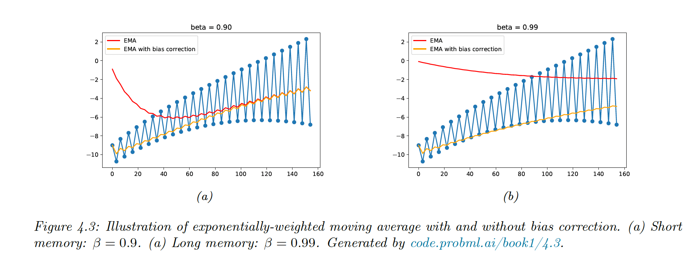

# 4.4 Other estimation methods

### 4.4.1 The methods of moment (MOM)

MOM is a simpler approach than computing MLE. Solve $K$ number of equations ($K$ is the number of parameters).

- The theoretical moments are given by $\mu_k=\mathbb{E}[Y^k]$
- The empirical moments are given by $\hat{\mu}_k=\frac{1}{N}\sum_ny_n^k$

We solve $\mu_k=\hat{\mu}_k$ for every k.

Example with the univariate Gaussian:

$\mu_1=\mu=\bar{y}$

$\mu_2=\sigma^2+\mu^2=s^2$ (since $\sigma^2=s^2-\mu^2$)

so:

$\hat{\mu}=\bar{y}$

$\hat{\sigma}^2=s^2-\bar{y}^2$

So in this case, this is similar to MLE.

Example with the uniform distribution:

$$
p(y|\theta)=\frac{1}{\theta_2-\theta_1} \mathbb{I}(\theta_1\leq y\leq\theta_2)
$$

$\mu_1=\mathbb{E}[Y]=\frac{\theta_1+\theta_2}{2}$

$\mu_2=\mathbb{E}[Y^2]=\frac{\theta_1^2+\theta_2\theta_1+\theta_1^2}{3}$

Inverting these equations to get $\theta_1$ and $\theta_2$, we see that these estimators sometimes give incorrect results.

To compute the MLE, we sort the data values. The likelihood is:

$$
p(\mathcal{D}|\theta_1, \theta_1)=(\frac{1}{\theta_2-\theta_1})^N \mathbb{I}(\theta_1\leq y_1)\mathbb{I}(y_N\leq\theta_2)
$$

Then, if we set $\theta=\theta_2-\theta_1$

$$
\frac{d}{d\theta} \mathrm{NLL}(\theta)=\frac{N}{\theta_2-\theta_1}
$$

This is minimized by $\hat{\theta}_1=y_1$ and $\hat{\theta}_2=y_N$, as one would expect.

### 4.4.2 Online (recursive) estimation

When data arrives sequentially we perform online learning.

Let $\hat{\theta}_{t-1}$ our estimate (e.g. MLE) given $\mathcal{D}_{1:t-1}$. To ensure our algorithms takes a constant time per update, our solution is in the form:

$$
\hat{\theta}_t=f(\hat{\theta}_{t-1},f_t)
$$

Example for the mean of Gaussian:

$$
\hat{\mu}_t=\sum_{n=1}^t y_n=\frac{1}{t}\Big((t-1)\hat{\mu}_{t-1}+y_t\Big)=\hat{\mu}_{t-1}+\frac{1}{t}(y_t-\hat{\mu}_{t-1})
$$

This is a moving average, the size of the correction diminish over time. However if the distribution is changing, we might want to give more weight to recent data points.

This is solved by exponentially-weighted moving average (EWMA)

$$
\hat{\mu}_t=\beta \hat{\mu}_{t—1}+(1-\beta)y_t
$$

with $0<\beta<1$

The contribution of a data point in k steps is $\beta^k(1-\beta)$.

Since the initial estimate starts from $\hat{\mu}_0=0$ there is an initial bias, corrected by scaling as 

$$
\tilde{\mu}_t=\frac{\hat{\mu}_t}{1-\beta^t}
$$

