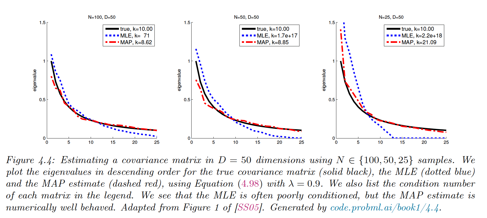
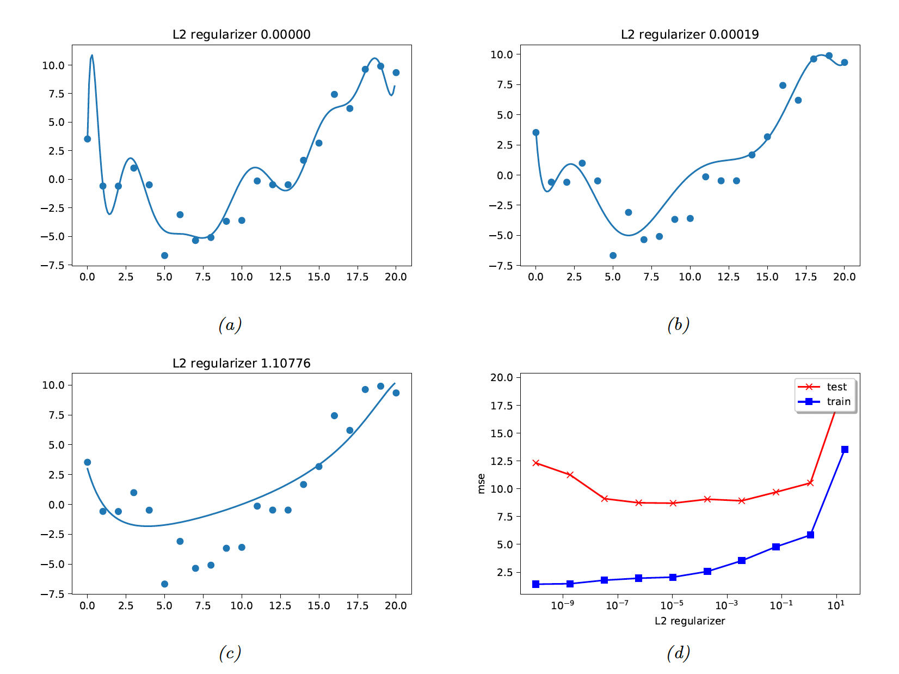
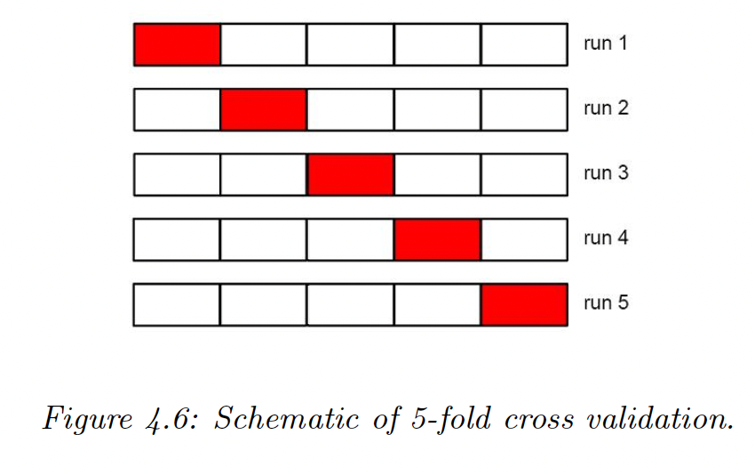
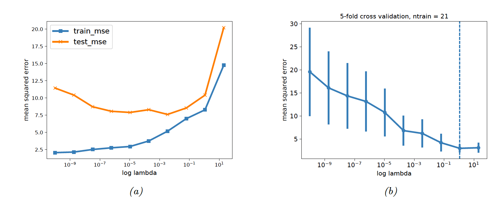
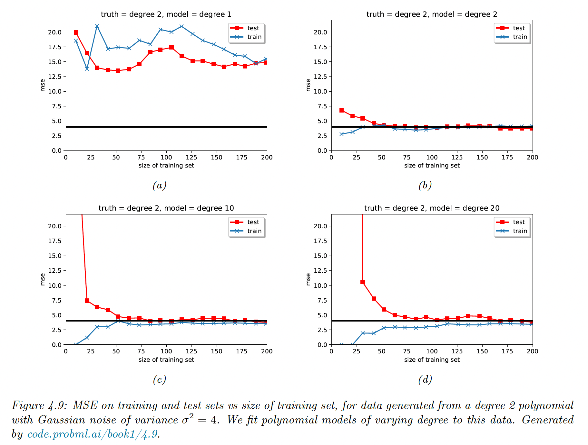

# 4.5 Regularization

The main issue with MLE and ERM is that they pick parameters by minimizing the loss on the training set, which can result in overfitting.

With enough parameters, a model can match any empirical distribution. However, in most cases the empirical distribution is not the same as the true distribution. Regularization add a penalty term to the NLL.

$$
\begin{align}
\mathcal{L}(\theta,\lambda)&=\frac{1}{N}\sum^N_{i=1}\ell(y_n,\theta,x_n)+\lambda C(\theta) \\
&=-\frac{1}{N}\sum^N_{i=1} \log p(y_n|x_n,\theta) -\lambda \log p(\theta)
\end{align} 
$$

by taking the log loss and the log prior for penalty term.

This is equivalent to minimizing the MAP:

$$
\hat{\theta}_{map}=\argmax_{\theta} \log p(\theta|\mathcal{D})=\argmax_{\theta} [\log p(\mathcal{D}|\theta)+\log p(\theta) -\mathrm{const}]
$$

### 4.5.1 MAP for Bernoulli distribution

If we observe just one head, $\theta_{mle}=1$. We add a penalty to $\theta$ to discourage extreme values.

With $p(\theta)\sim Beta(a,b)$, and $a,b>1$, we encourage values of $\theta$ near to the mean ${a}/(a+b)$

$$
\begin{align}
\mathrm{LL}(\theta)&=\log p(\mathcal{D}|\theta)+\log p(\theta) \\
&= N_0 \log\theta+ N_1 \log(1 - \theta) + (a-1)\log \theta + (b-1)\log (1-\theta)
\end{align}
$$

With the same method as the MLE, we find:

$$
\hat{\theta}_{map}=\frac{N_1+a-1}{N+a+b-2}=\frac{N_1+1}{N+2}
$$

By setting $a=2, b=2$, we resolve the zero-count problem.

Regularization combines empirical data and prior knowledge. 

### 4.5.2 MAP for MVN

We showed that the MLE for covariance of a MVN is $\hat{\Sigma}=\frac{1}{N}S_{\bar{y}}$. In high dimensions, the scatter matrix can easily become singular. One solution is to perform MAP estimation.

A convenient prior to use for $\Sigma$ is the Wishart distribution (generalization of the Gamma distribution). The resulting MAP is:

$$
\hat{\Sigma}_{map}=\frac{\breve{S}+S_{\bar{y}}}{\breve{N}+N}=\frac{\breve{N}}{\breve{N}+N}\frac{\breve{S}}{\breve{N}}+\frac{N}{\breve{N}+N}\frac{S_{\bar{y}}}{N}=\lambda \Sigma_0+(1-\lambda)\hat{\Sigma}_{mle}
$$

where $\lambda$ controls the amount of regularization.

If we set $\breve{S}=N \mathrm{diag}(\hat{\Sigma}_{mle})$:

$$
\hat{\Sigma}_{map}(i,j)=\begin{cases}
\hat{\Sigma}_{mle}&\mathrm{if}\,i=j \\
(1-\lambda)\hat{\Sigma}_{mle} & o.w.
\end{cases}
$$

Off-diagonal elements are shrunk toward 0. $\lambda$ can be chosen via cross-validation of via close form (implemented in [scikit-learn LedoitWolf](https://scikit-learn.org/stable/modules/generated/sklearn.covariance.LedoitWolf.html)).

The benefits of the MAP is to better behaved than MLE, with eigenvalues of the estimate closer to that of the true covariance matrix (the eigenvectors however are unaffected).

### 4.5.3 Weight decay

We saw that reducing the degree of the polynomial help the regression task. A more general solution is to add regularization to the regression coefficients.

$$
\hat{w}_{map}=\argmin_w \mathrm{NLL}(w)+\lambda ||w||_2^2
$$

where a higher $\lambda$ means more pressure toward low coefficients and thus less flexibility for the model. This is ridge regression.

### 4.5.4 Picking **𝝺** by cross validation

We split the training data into $K$ folds and iteratively fit on all fold except one, used for validation.

We have

$$
R_\lambda(\theta,\mathcal{D})=\frac{1}{|D|}\sum_{(x,y) \in \mathcal{D}} \ell(y,f(x,\theta))+\lambda C(\theta)
$$

So

$$
\hat{\lambda} =\argmin_\lambda R^{cv}_\lambda =\argmin_\lambda\frac{1}{K}\sum_{k=1}^K R_0(\hat{\theta}_{\lambda}(\mathcal{D}_{-k}),\mathcal{D}_k)
$$

Finally

$$
\hat{\theta}=\argmin_{\theta}R_{\hat{\lambda}}(\theta,\mathcal{D})
$$

The standard error of our estimate is:

$$
\mathrm{se}=\frac{\hat{\sigma}}{\sqrt{n}}
$$

where $\hat{\sigma}=\mathrm{Var}[\ell(y,f(x,\hat{\theta}))]$

### 4.5.7 Using more data

When a model is too simplistic, it fails to improve as the data grow. A overly complex model will end up converging toward the right solution if enough data is provided.

