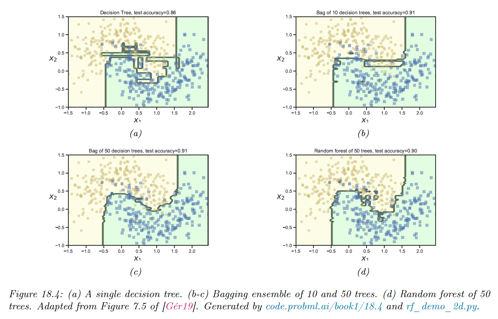

# 18.3 Bagging

**Bagging** stands for “bootstrap aggregating” . This is a simple form of ensemble learning in which we fit $M$ base models to different randomly sampled version of the data. This encourages the different models to make diverse predictions.

The datasets are sampled with replacement (this is bootstrap sampling), so a given example may appear multiple time until we have a total of $N$ examples per model ($N$ being the size of the original dataset).

The disadvantage of bootstrap is that on average, base models only see 63% of the unique dataset. Indeed, the probability for a point to not be selected from a set of size $N$, in $N$ draws is

$$
\lim_{N\rightarrow +\infin} (1-1/N)^N =e^{-1}\approx 0.37
$$

which means only $1-0.37=0.63$ data points are selected.

The remaining training instances are called **out-of-bag (OOB)**. We can use the predicted performances of the model on the OOB set as an estimate of test set performances, as an alternative to cross-validation.

The main advantage of bootstrap is preventing the ensemble to rely too much on individual train point, which enhances robustness and generalization.

This advantage increases with the size of the ensemble, with the tradeoff of taking more time and memory to train.

Bagging doesn’t always improve performance, and stable models like nearest neighbors classifiers won’t benefit much from it.

For neural networks, things are more nuanced. They are unstable wrt the training set, however they will underperform if they only see 63% of the training set. So, bagged DNNs do not usually work well.