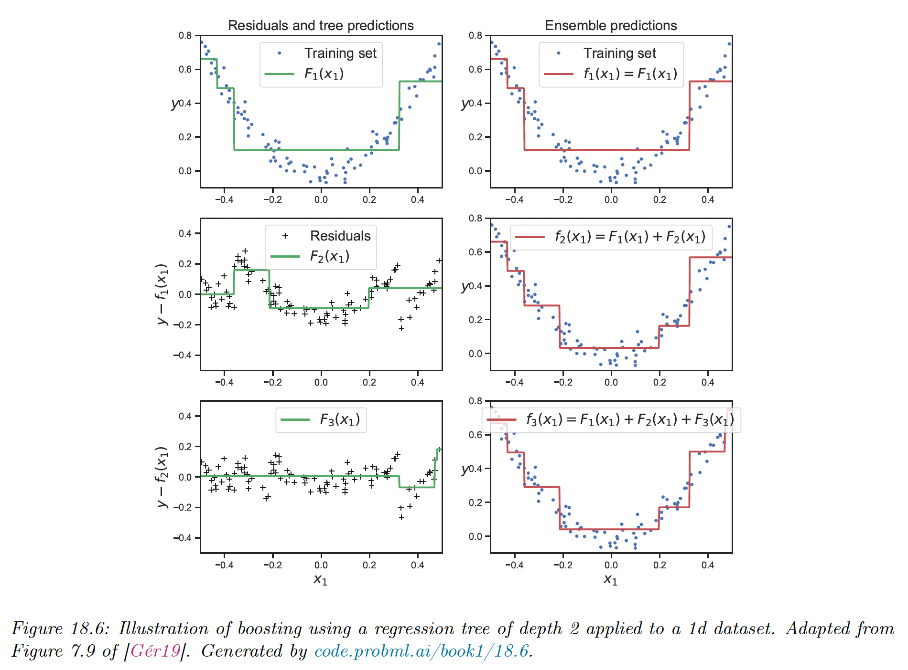
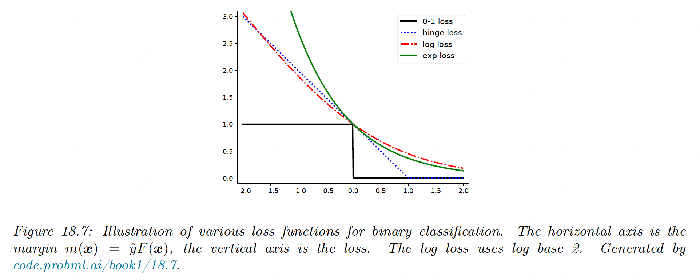
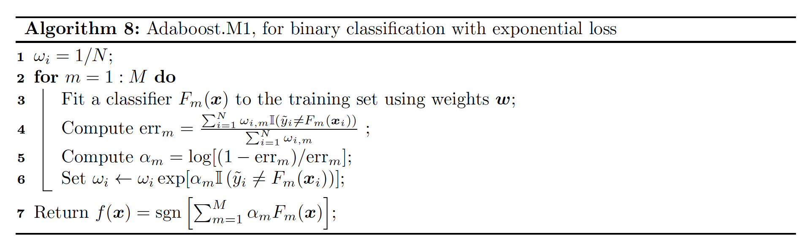
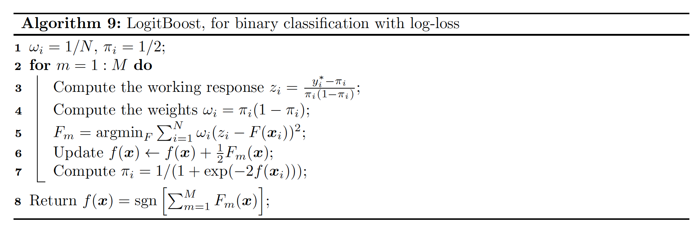
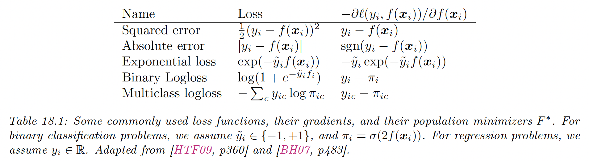
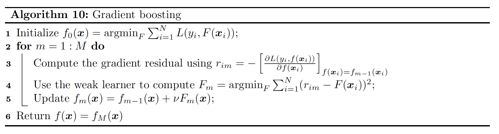

# 18.5 Boosting

Ensemble of trees, whether fit using bagging or the random forest algorithm, corresponds to a model of the form:

$$
f(\bold{x};\theta)=\sum_{m=1}^M \beta_m F_m(\bold{x};\theta_m)
$$

where $F_m$ is the $m$th tree and $\beta_m$ is the corresponding weight, often set to $\beta_m=1/M$.

We can generalize this by allowing the $F_m$ functions to be general function approximators, such as neural nets. The result is called **additive model**.

We can think of this as a linear function with **adaptative basis functions**. The goal, as usual, is to minimize the empirical loss function.

The original **boosting** algorithm sequentially fits additive models where each $F_m$ is a binary classifiers that returns $F_m\in\{-1,+1\}$.

- We first fit $F_1$ on the original dataset, then we weight the data samples by the errors made by $F_1$, so misclassified example get more weight.
- Next, we fit $F_2$ on this weighted dataset.
- We keep repeating this process until $M$ number of components have been fitted (where $M$ is a hyper-parameter that controls the complexity of the overall-model, and can be chosen by monitoring the performance on a validation dataset, via early-stopping).

It can be shown that as long as each $F_m$ has an accuracy above chance level (even slightly above 50%), then the final ensemble of classifiers will have a higher accuracy that any individual $F_m$.

In other words, we can boost a **weak learner** $F_m$ into a **strong learner**.

Note that boosting reduces the bias of strong learner by fitting trees that depends on each other, whereas bagging and RF reduces the variance by fitting independent trees.

In the rest of this section, we focus on boosting model with arbitrary loss function, suitable for regression, multiclass classification or ranking.

### 18.5.1 Forward stagewise additive modeling

We sequentially optimize the empirical objective for differentiable loss functions. At iteration $m$, we compute:

$$
(\beta_m,\theta_m)=\argmin_{\beta,\theta} \sum_{i=1}^N \ell(y_i,f_{m-1}(\bold{x}_i)+\beta F(\bold{x}_i;\theta))
$$

where $f$ is an additive model.

We then set:

$$
\begin{align}
f_m(\bold{x}) &= f_{m-1}(\bold{x})+\beta_m F(\bold{x};\theta_m) \\
&= f_{m-1}(\bold{x})+\beta_mF_m(\bold{x})
\end{align}
$$

Note that we don’t adjust the weight of the previously added models.

This optimization step depends on the loss function that we choose, and (in some cases) on the form of the weak learner $F$.

### 18.5.2 Quadratic loss and least square boosting

If we use a squared error loss, the $i$th term in the objective at step $m$ becomes:

$$
\ell(y_i, \hat{y}_i)=(y_i-f_{m-1}(\bold{x}_i)-\beta F(\bold{x}_i;\theta))^2=(r_{m,i}-\beta F(\bold{x}_i;\theta))^2
$$

where $r_{m,i}=y_i-f_{m-1}(\bold{x}_i)$ is the residual at step $m$ of the $i$th observation.

We can minimize this objective by simply setting $\beta=1$ and fitting $F$ to the residual errors. This is called **least square boosting**.

We see how each new weak learner that is added to the ensemble corrects the error made by the earlier version of the model.

### 18.5.3 Exponential loss and AdaBoost

Suppose we are interested in binary classification, i.e predicting $\tilde{y}_i\in\{-1,+1\}$. Let assume the weak learner computes:

$$
p(y=1|\bold{x})=\frac{e^{F(\bold{x})}}{e^{F(\bold{x})}+e^{-F(\bold{x})}}=\frac{1}{1+e^{-2F(\bold{x})}}
$$

The negative log likelihood from section 10.2.3 gives us:

$$
\ell(\tilde{y},F(\bold{x}))=\log(1+e^{-2\tilde{y}F(\bold{x})})
$$

We can minimize this by ensuring the **margin $m(\bold{x})=\tilde{y}F(\bold{x})$** is as large as possible.

We see in the figure below that the log loss is an upper bound on the 0-1 loss.

In this section, we consider the **exponential loss** $\ell(\tilde{y},F(\bold{x}))=\exp(-\tilde{y}F(\bold{x}))$ instead, since it has the same optimal solution as the log loss when the sample size grows to infinity, but it is easier to optimize in the boosting setting.

To see the equivalence with the log loss, we can set the derivative of the expected exponential loss to zero:

$$
\begin{align}
\frac{\partial}{\partial F(\bold{x})}\mathbb{E}[e^{-\tilde{y}F(\bold{x})}|\bold{x}]
& =\frac{\partial}{\partial F(\bold{x})}[p(\tilde{y}=1|\bold{x})e^{-F(\bold{x})}+p(\tilde{y}=-1|\bold{x})e^{F(\bold{x})}]=0
\\
& \implies F(\bold{x})=\frac{1}{2}\log \frac{p(\tilde{y}=1|\bold{x})}{p(\tilde{y}=-1|\bold{x})}
\end{align}
$$

We will now discuss how to solve for the $m$th weak learner $F_m$ when we use the exponential loss.

- When $F_m$ returns a binary label, it is called **discrete Adaboost**
- When $F_m$ returns a probability instead, it is called **real Adaboost**

At step $m$, we have to minimize:

$$
L_m=\sum_{i=1}^N \exp[-\tilde{y}_i(f_{m-1}(\bold{x}_i)+\beta F(\bold{x}_i))]=\sum_{n=1}^Nw_{m,i} \exp(-\beta\tilde{y}_i F(\bold{x}_i))
$$

where

$$
w_{m,i}\triangleq  \exp(-\tilde{y}_i f_{m-1}(\bold{x}_i))
$$

 is a weight applied to the $i$th sample.

We can rewrite the objective as follows:

$$
\begin{align}
L_m &= e^{-\beta}\sum_{\tilde{y}_i=F(\bold{x}_i)}w_{m,i} +e^{\beta}\sum_{\tilde{y}_i\neq F(\bold{x}_i)} w_{m,i} \\
&= (e^{\beta}-e^{-\beta})\sum_{n=1}^N \mathbb{I}(\tilde{y}_i\neq F(\bold{x}_i))w_{m,i}+e^{-\beta}\sum_{n=1}^N w_{m,i}
\end{align}
$$

Consequently the optimal function to add is:

$$
F_m=\argmin_F\sum_{n=1}^N \mathbb{I}(\tilde{y}_i\neq F(\bold{x}_i))w_{m,i}
$$

This can be found by applying the weak learner to a weighted version of the dataset, with weights $w_{m,i}$.

All that remains is to solve for the size of the update $\beta$, by substituting $F_m$ into $L_m$:

$$
\beta_m=\frac{1}{2}\log \frac{1-\mathrm{err}_m}{\mathrm{err}_m}
$$

where

$$
\mathrm{err}_m=\frac{\sum_{n=1}^N \mathbb{I}(\tilde{y}_i \neq F(\bold{x}_i)) w_{m,i}}{\sum_{n=1}^N w_{m,i}}
$$

After updating the strong learner, we recompute the weight for the next iteration:

$$
w_{m+1,i}=e^{-\tilde{y}_if_m(\bold{x}_i)}=e^{-\tilde{y}_i(f_{m-1}(\bold{x}_i)+\beta_mF_m(\bold{x}_i))} 
= w_{m,i} e^{-\tilde{y}_i\beta_mF_m(\bold{x}_i)}
$$

Since $\tilde{y}_i F_m(\bold{x}_i) = 2\mathbb{I}(\tilde{y}_i=F_m(\bold{x}_i))-1$, we finally have:

$$
w_{m+1,i}=w_{m,i}e^{2\mathbb{I}(\tilde{y}_i=F_m(\bold{x}_i))\beta_m}e^{-\beta_m}
$$

Since $e^{-\beta_m}$ is constant across all examples it can be dropped.

If we then define $\alpha_m=2\beta_m$ we have:

$$
w_{m+1,i}=\begin{cases}
w_{m,i}e^{\alpha_m} & \mathrm{if}\;\tilde{y}_i \neq F_m(\bold{x}_i)
\\
w_{m,i} & \mathrm{o.w.}
\end{cases}
$$

We then see that we exponentially increase the weights of misclassified examples. This algorithm is known as **Adaboost.**

A multiclass generalization of exponential loss, and an adaboost-like algorithm to minimize it is known as **SAMME** (stagewise additive modeling using a multiclass exponential loss function) — this is the implementation of the Adaboost classifier in scikit-learn.

### 18.5.4 LogitBoost

The trouble with exponential loss is that it puts a lot of weight on misclassified examples.

In addition, $e^{-yf}$ is not the logarithm of any pmf for binary variables $\tilde{y}\in\{-1,+1\}$, hence we can’t recover probabilities from $f(\bold{x})$.

A natural alternative is to use log-loss, which only punishes mistakes linearly, and we’ll be able to extract probability using:

$$
p(y=1|\bold{x})=\frac{e^{f(\bold{x})}}{e^{f(\bold{x})}+e^{-f(\bold{x})}}=\frac{1}{1+e^{-2f(\bold{x})}}
$$

The goal is to minimize the expected log-loss:

$$
L_m=\sum_{n=1}^N \log(1+\exp[-2\tilde{y}_if_m(\bold{x}_i)])
$$

By performing Newton update on this update, similarly to IRLS, one can derive the algorithm below, known as **logitBoost**.

The key subroutine is the ability for the weak learner to solve a weighted least square problem.

### 18.5.5 Gradient Boosting

Rather than deriving a new boosting algorithm for each loss function, we can derive a generic version known as **gradient boosting.**

We solve $\bold{\hat{f}}=\argmin _\bold{f}\mathcal{L}(\bold{f})$ by performing gradient descent in the space of functions. Since functions are infinite dimensional objects, we will represent them by their values on the training set $\bold{f}=(f(\bold{x}_1),\dots,f(\bold{x}_N))$.

At step $m$, let $\bold{g}_m$ be the gradient of $\mathcal{L}(\bold{f})$ evaluated at $\bold{f}=\bold{f}_{m-1}$:

$$
g_{im}=\Big[\frac{\partial \ell(y_i,f(\bold{x}_i))}{\partial f(\bold{x}_i)}\Big]_{\bold{f}=\bold{f}_{m-1}}
$$

Gradient of some common loss functions are given by:

We then make the update:

$$
\bold{f}_m=\bold{f}_{m-1}-\beta_m \bold{g}_m
$$

where $\beta_m$ is the step length, chosen by:

$$
\beta_m=\argmin_\beta \mathcal{L}(\bold{f}_{m-1}-\beta\bold{g}_m)
$$

In its current form, this algorithm is not useful because it only optimize $\bold{f}$ on a fixed set of points, so we don’t learn a function that can generalize.

Instead, we can modify this algorithm by fitting a weak learner to approximate of the negative  gradient signal. We use the update:

$$
F_m(\bold{x}) = \argmin_F \sum_{i=1}^N (-g_{im}-F(\bold{x}_i))^2
$$

The overall algorithm is:

We have introduced a learning rate $0< \nu\leq 1$ to control the size of the updates, for regularization purposes.

If we apply this algorithm using squared loss, we recover L2Boosting since $-g_{im}=y_i-f_{m-1}(\bold{x}_i)$

For classification, we can use log-loss. In this case, we get an algorithm known as **BinomialBoost**. Its advantage over **LogitBoost** is that is doesn’t need to apply weighted fitting, it just applies any black-box regression model to the gradient vector.

To apply this to multiclass classification, we can fit $C$ separate regression trees, using the pseudo residual of the form:

$$
-g_{mic}=\frac{\partial \ell(y_i,f_{m1}(\bold{x}_i),\dots,f_{mC}(\bold{x}_i))}{\partial f_{mc}(\bold{x}_i)}=\mathbb{I}(y_i=c)-\pi_{ic}
$$

Although the trees are fit separately, their predictions are combined using softmax:

$$
p(y=c|\bold{x})=\frac{e^{f_c(\bold{x})}}{\sum_{c'}e^{f_{c'}(\bold{x})}}
$$

When we have large datasets, we can use stochastic variant in which we subsample (without replacement) a random fraction of the data to pass the regression tree at each iteration.

This is called **stochastic gradient boosting**. Not only is it faster, but it also better generalizes because subsampling the data is a form of regularization.

**18.5.5.1 Gradient tree boosting**

In practice, gradient boosting nearly always assume the weak learner is a regression tree, which is a model of the form:

$$
F_m(\bold{x})=\sum_{j=1}^J w_{mj}\mathbb{I}(\bold{x}\in R_{mj})
$$

where $w_{mj}$ is the predicted output for region $R_{mj}$ (in general $w_{mj}$ can be a vector). This combination is called **gradient boosting regression trees**. A relative version is known as **MART** (multivariate additive regression trees).

To use this in gradient boosting, we first find good regions $R_{mj}$ for tree $m$ using standard regresion tree learning on the residuals.

Then, we (re)solve for the weight of each leaf by solving:

$$
\hat{w}_{mj}=\argmin_{w}\sum_{\bold{x}_i \in R_{mj}}\ell(y_i,f_{m-1}(\bold{x}_i)-w)
$$

For squared error, the optimal weight is just the mean of the residuals in that leaf.

 

**18.5.5.2 XGBoost**

XGBoost, which stands for extreme gradient boosting, is a very efficient and widely used implementation of gradient boosted trees, and add a few more improvements:

- It adds a regularizer to the tree complexity
- It uses a second-order approximation of the loss instead of a linear approximation
- It samples features at internal nodes (as in random forests)
- It ensures scalability on large datasets by using out-of-core methods

Other popular implementations are **LightGBM** and **CatBoost**.

XGBoost optimizes the following objective:

$$
\mathcal{L}(f)=\sum_{n=1}^N\ell(y_i,f(\bold{x}_i))+\Omega(f)
$$

where:

$$
\Omega(f)=\gamma J+\frac{1}{2}\lambda\sum_{j=1}^J w_j^2
$$

is the regularizer, $J$ is the number of leaves and $\gamma\geq 0$ and $\lambda\geq 0$ are regularization coefficients.

At the $m$th step, the loss is given by:

$$
\mathcal{L}_m(F_m)=\sum_{i=1}^N\ell(y_i,f_{m-1}(\bold{x}_i)+F_m(\bold{x}_i))+\Omega(F_m)+cte
$$

We compute a second order Taylor expansion as follows:

$$
\mathcal{L}_m(F_m)\approx\sum_{i=1}^N\Big[\ell(y_i,f_{m-1}(\bold{x}_i))+g_{mi}F_m(\bold{x}_i)+\frac{1}{2}h_{mi}F_m(\bold{x}_i)^2\Big]+\Omega(F_m)+cte
$$

where $h_{mi}$ is the hessian:

$$
h_{mi}=\Big[\frac{\partial^2 \ell(y_i,f(\bold{x}_i))}{\partial^2 f(\bold{x}_i)}\Big]_{f=f_{m-1}}
$$

In the case of regression trees, we have $F(\bold{x})=w_{q({\bold{x}})}$, where $q:\R^D\rightarrow \{1,\dots,J\}$ specifies which node the input $\bold{x}$ belongs to, and $\bold{w} \in \R^J$ are the leaf weights.

We can rewrite the loss by removing elements that are independent of $F_m$:

$$
\begin{align}
\mathcal{L}_m(q,\bold{w})&\approx \sum_{i=1}^N \Big[g_{mi}F_m(\bold{x}_i)+\frac{1}{2}h_{mi}F_m(\bold{x}_i)^2\Big]+\gamma J+\frac{1}{2}\lambda\sum_{j=1}^Jw_j^2 \\
&=\sum_{j=1}^J \Bigg[(\sum_{i\in I_j}g_{mi})w_j+\frac{1}{2}(\sum_{i\in I_j}h_{mi}+\lambda )w_{j}^2\Bigg]+\gamma J \\
&= \sum_{j=1}^J \Big[G_{mj} w_j+\frac{1}{2}(H_{mj}+\lambda) w_j^2\Big]+\gamma J
\end{align}
$$

with $I_j=\{i:q(\bold{x}_i)=j\}$ is the set of indices of points assigned to leaf $j$.

This is quadratic in each $w_j$, so the optimal weights are given by:

$$
w_j^*=-\frac{G_{mj}}{H_{mj}+\lambda}
$$

The loss for evaluating different tree structures $q$ then becomes:

$$
\mathcal{L}_m(q,\bold{w}^*)=-\frac{1}{2}\sum_{j=1}^J\frac{G_{mj}^2}{H_{mj}+\lambda}+\gamma J
$$

We can greedily optimize this using a recursive node splitting procedure. For a given leaf $j$, we consider splitting it into a left and right partition $I=I_L \lor  I_R$.

We can compute the gain (i.e. the reduction in loss) of this split:

$$
\mathrm{gain}=\frac{1}{2}\Big[\frac{G_L^2}{H_L+\lambda}+\frac{G_R^2}{H_R+\lambda}-\frac{(G_L+G_R)^2}{(H_L+H_R)+\lambda}\Big]-\gamma
$$

where $G_L=\sum_{i\in I_L}g_{mi}$ and $H_L=\sum_{i\in I_L}h_{mi}$

Thus, we see that it is not worth splitting if the gain is negative (the first term is below $\gamma.$