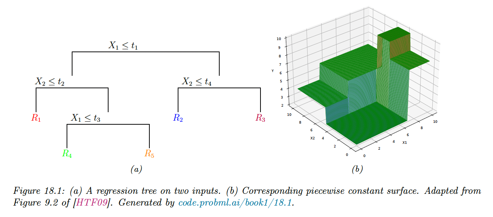
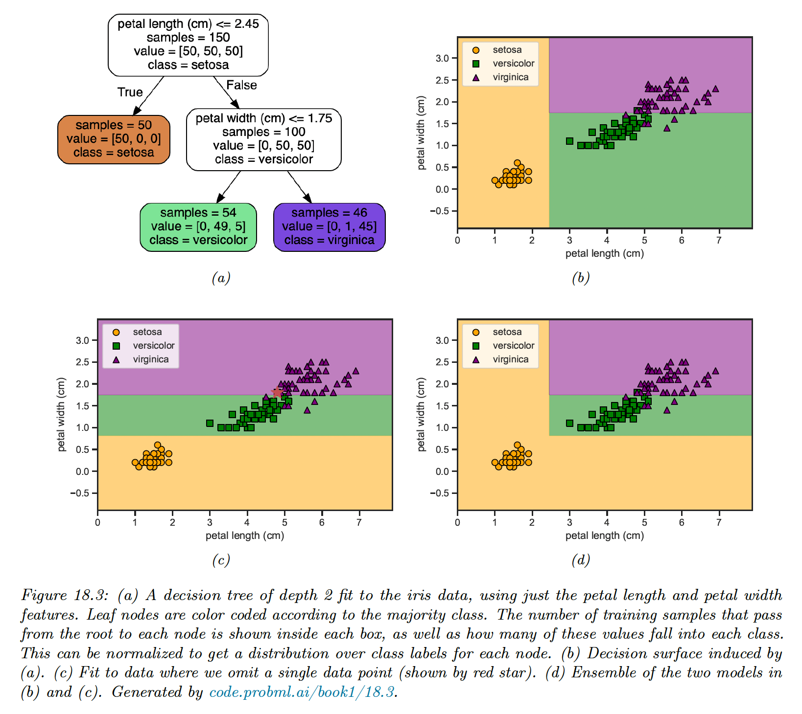

# 18.1 Classification and regression tree (CART)

Classification and regression trees (also called CART models or decision trees) are defined by recursively partitioning the input space and defining a local model on each resulting region of the input space.

The overall model can be represented by a tree, with one leaf per region.

### 18.1.1 Model definition

We start by considering regression tree.

Trees consist of a set of nested decision rules. At each node $i$, the feature $d_i$ of the input vector $\bold{x}$ is compared to a threshold $t_i$: if it’s lower, the input flows to the left branch, otherwise to the right.

At the leaves of the tree, the model specify the predicted output for any input that falls in this region.

In the above example, the first region of space is defined by:

$$
R_1=\{\bold{x}:x_1\leq t_1,x_2 \leq t_2\}
$$

The overall result is that we partition the 2d input space into 5 regions. We can now associate a mean response with each of these regions, resulting in a piecewise constant surface.

The output from region 1 can be estimated using:

$$
w_j=\frac{\sum_{n=1}^Ny_n \mathbb{I}(\bold{x}_n\in R_1)}{\sum_{n=1}^N\mathbb{I}(\bold{x}_n\in R_1)}
$$

Formally, a regression tree can be defined as:

$$
f(\bold{x};\bold{\theta})=\sum_{j=1}^Jw_j \mathbb{I}(\bold{x}_j\in R_j)
$$

where $w_j$ is the predicted output for the node $j$ and $\bold{\theta}=\{(R_j,w_j): j=1:J\}$ where $J$ is the number of nodes. We can express the regions as $R_1=[(d_1\leq t_1),(d_2,\leq t_2)]$.

For classification problems, the leaves contains a distribution over the class labels rather than the mean response.

### 18.1.2 Model fitting

To fit the model, we need to minimize the following loss: 

$$
\mathcal{L}(\bold{\theta})=\sum_{n=1}^N\ell(y_n,f(\bold{x}_n;\bold{\theta}))= \sum_{j=1}^J\sum_{\bold{x}_j \in R_j} \ell(y_n; w_j)
$$

Unfortunately, this is not differentiable because of the need to learn the tree structure. Finding the optimal partitioning of the data is NP-complete.

The standard practice is to use a greedy procedure to grow the tree one node at a time. This approach is used by CART, C4.5 and ID3 which are three popular implementations of the method. Scikit-learn uses an optimized version of CART.

The idea is the following. Suppose we are at node $i$; let $D_i=\{(\bold{x}_n, y_n)\in N_i\}$ be the set of examples that reach this node. We consider how to split this node into a left branch and a right branch to minimize the error in each child subtree.

If the $j$th feature is a real-valued scalar, we can partition $\mathcal{D}_i$ by comparing to a threshold $t$. The set of possible thresholds $\mathcal{T}_j$ for feature $j$ can be obtained by sorting the unique values of $x_{nj}$.

For each possible threshold we define the left and right splits:

$$
D_i^L(j,t)=\{ (\bold{x}_n,y_n) \in N_i:x_{n,j}\leq t\} \\
D_i^R(j,t)=\{ (\bold{x}_n,y_n) \in N_i:x_{n,j}>t\}
$$

If the $j$th feature is categorical, with $K_j$ possible values, we check if the feature if the feature is equal to each of those values or not. This defines a $K_j$ set of possible binary splits:

$$
D_i^L(j,t)=\{ (\bold{x}_n,y_n) \in N_i:x_{n,j}= t\} \\
D_i^R(j,t)=\{ (\bold{x}_n,y_n) \in N_i:x_{n,j}\neq t\}
$$

Alternatively, we could allow multi-way split, but this could lead to **data fragmentation** with too little data falling into each subtree, leading to overfitting. Therefore it is more common to use binary splits.

Once we have computed $D^L_i(j,t)$ and $D_i^R(j,t)$ for each $j$ and $t$ at node $i$, we choose the best feature $j_i$ to split on, and the best value for this feature $t_i$ as follows:

$$
(j_i,t_i)=\arg \min_{j\in\{1,\dots,D\}} \min_{t\in\mathcal{T}_j} \frac{|\mathcal{D}_i^L(j,t)|}{|\mathcal{D}_i|}c(\mathcal{D}_i^L(j,t))+ \frac{|\mathcal{D}_i^R(j,t)|}{|\mathcal{D}_i|}c(\mathcal{D}_i^R(j,t))
$$

We then partition the data and call the fitting algorithm recursively on each subset of the data.

We now discuss the cost function $c(\mathcal{D}_i)$ which is used to evaluate the cost of node $i$.

For regression, we could use the mean squared error:

$$
c(\mathcal{D}_i)=\frac{1}{|\mathcal{D}_i|}\sum_{n \in \mathcal{D}_i}(\bar{y}-y_n)^2
$$

where $\bar{y}=\frac{1}{|D_i|}\sum_{n\in\mathcal{D}_i}y_n$ is the mean of the response variable for examples reaching node $i$.

For classification, we begin by computing the empirical distribution over class labels for this node:

$$
\hat{\pi}_{i,c}=\frac{1}{|\mathcal{D}_i|}\sum_{n\in\mathcal{D}_i}\mathbb{I}(y_n=c)
$$

Given this, we can compute the **Gini index**:

$$
G_i=\sum_{c=1}^C \hat{\pi}_{i,c}(1-\hat{\pi}_{i,c})=1-\sum_{c=1}^C \hat{\pi}_{i,c}^2
$$

This is the expected error rate, since $\hat{\pi}_{i,c}$ is the probability for a random entry in the leaf belong to class $c$, and $1-\hat{\pi}_{i,c}$ the probability it would be misclassified.

Alternatively we can define the cost as the entropy or **deviance** of the node:

$$
H_i=\mathbb{H}(\hat{\pi}_{i})=-\sum_{c=1}^C \hat{\pi}_{i,c}\log(\hat{\pi}_{i,c})
$$

A node that is **pure** (i.e. only has example of one class) will have 0 entropy.

### 18.1.3 Regularization

If we let the tree become deep enough, it can reach an error 0 (assuming no label noise) by partitioning the input space is sufficiently small regions. This leads to overfitting, and there are two main regularization approaches:

1. Stop the tree growing process using some heuristic, like reaching a maximum depth or having too few sample at a node.
2. Grow the tree to its maximum depth and **prune** it back, by merging split subtree into their parent. This can partially overcome the greedy nature of top-down tree growing. However, forward growing and backward pruning is slower than the greedy top-down approach.

### 18.1.4 Handling missing input features

In general, it is hard for discriminative models to handle missing input features. However, for trees, simple heuristics can work well.

1. **Surrogate splits** leverages highly correlated features, inducing similar partition when the chosen variable is missing at test time. This can be thought as learning a local joint model of the input. This has the advantage over a generative model to not modeling the entire joint distribution of inputs, but has the disadvantage of being completely ad-hoc
2. A simpler approach is to create a new “missing” category, and then treat data as fully observed.

### 18.1.5 Pros and cons

Tree models are popular for several reasons:

- They are easy to interpret
- They can easily handle mixed discrete and continuous inputs
- They are insensitive to monotone transformations of the inputs (since splits are based on ranking the data points) so there is no need to standardize the data
- They perform automatic variable selection
- They are relatively robust to outliers
- They are fast to fit, and scale well to large data sets.
- They can handle missing value features

However, the primary disadvantage of trees is that they don’t predict very accurately compared to other kind of model, due to the greedy nature of tree construction.

A related problem is that they are **unstable**: small changes of the input data can have large effects on the structure of the tree, due to its hierarchical nature.

Below, omitting a single training point can dramatically change the decision surface, due to the use of axis parallel split.

We’ll later see how this instability can be turned into a virtue.