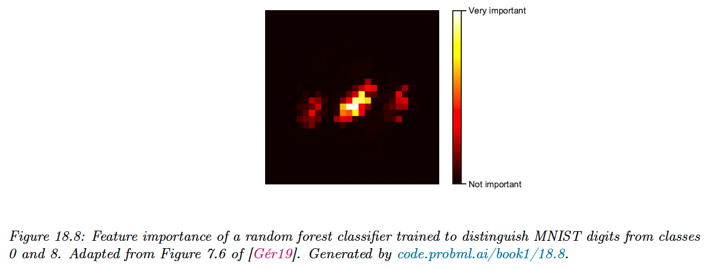
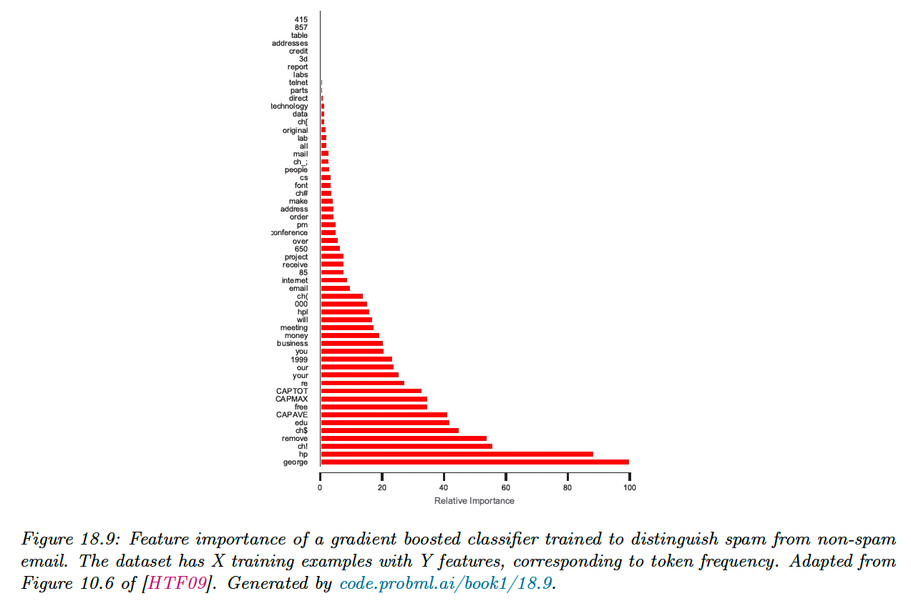
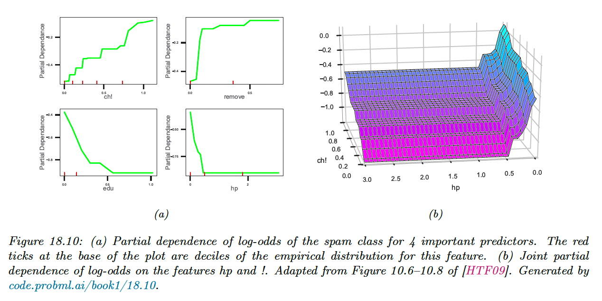

# 18.6 Interpreting tree ensembles

Trees are popular because they are interpretable. Unfortunately, ensembles of trees lose that property.

Fortunately, there are some simple methods to interpret what function has been learned.

### 18.6.1 Feature importance

For a single decision tree $T$, we can consider the following measure of feature importance for feature $k$:

$$
R_k(T)=\sum_{j=1}^{J-1}G_j \mathbb{I}(v_j=k)
$$

where the sum is over all the non-leaf (internal) nodes, $G_j$ is the gain in accuracy (reduction in cost) at node $j$, and $v_j=k$ if node $j$ uses feature $k$.

We can get a more accurate estimate by averaging over all trees of the ensemble:

$$
R_k=\frac{1}{M}\sum_{m=1}^N R_k(T_m)
$$

We can then normalize the scores so that the highest is 100%.

However, there are two limitations of impurity-based feature importances:

- impurity-based importances are biased towards high cardinality features;
- impurity-based importances are computed on training set statistics and therefore do not reflect the ability of feature to be useful to make predictions that generalize to the test set (when the model has enough capacity).

Instead, [scikit-learn suggests using permutation importance](https://scikit-learn.org/stable/auto_examples/inspection/plot_permutation_importance.html#sphx-glr-auto-examples-inspection-plot-permutation-importance-py).

### 18.6.2 Partial dependency plot (PDP)

After we have identified the most relevant input features, we can try to assess the impact they have on the output.

A **partial dependency plot** for feature $k$ has the form:

$$
\bar{f}_k(x_k)=\frac{1}{N}\sum_{i=1}^N f(\bold{x}_{i,-k},x_k)
$$

We plot $\bar{f_k}$ vs $x_k$.

Thus we marginalize out all features except $k$. In the case of binary classifier we can convert the output in log odds before plotting.

In figure a), we see that the probability of the spam increases when the frequency of “!” and “remove” increases.

Conversely, this probability decreases when the frequency of “edu” or “hp” increases.

We can also try to capture interaction effects between feature $j$ and $k$ by computing:

$$
\bar{f}_{jk}(x_j,x_k)=\frac{1}{N}\sum_{n=1}^N f(\bold{x}_{-j,k},x_j,x_k)
$$

In figure b), we see that the probability of spam increases when the frequency of “!” increases, but much more so when the word “hp” is missing.

[See scikit-learn documentation for computation methods.](https://scikit-learn.org/stable/modules/partial_dependence.html#computation-methods)