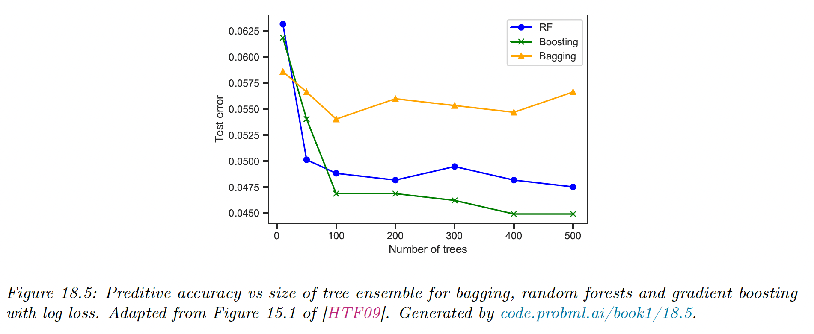

# 18.4 Random Forests

Bagging relies on the assumption that re-running the algorithme on different subsets of the data will result in sufficiently diverse base models.

The random forests approach tries to decorrelate the base learners even further by learning trees based on a randomly chosen subset of input variables (at each node of the tree) $S_i=\{1,\dots,D\}$, as well as a randomly chosen subset of data case.

The figure above shows that random forest work much better than bagged decision trees, because in this spam classification dataset, many input features are irrelevant.

We also see that boosting works even better, but relies on a sequential fitting of trees, whereas random forests can be fit in parallel.

When it comes to aggregating the predictions of base models, note that the [scikit-learn random forests implementation](https://scikit-learn.org/stable/modules/ensemble.html#random-forests) combines classifiers by averaging their probabilistic prediction, instead of letting each classifier vote for a single class.

See [scikit-learn comparison of random forests and gradient boosting trees](https://scikit-learn.org/stable/auto_examples/ensemble/plot_forest_hist_grad_boosting_comparison.html#sphx-glr-auto-examples-ensemble-plot-forest-hist-grad-boosting-comparison-py).